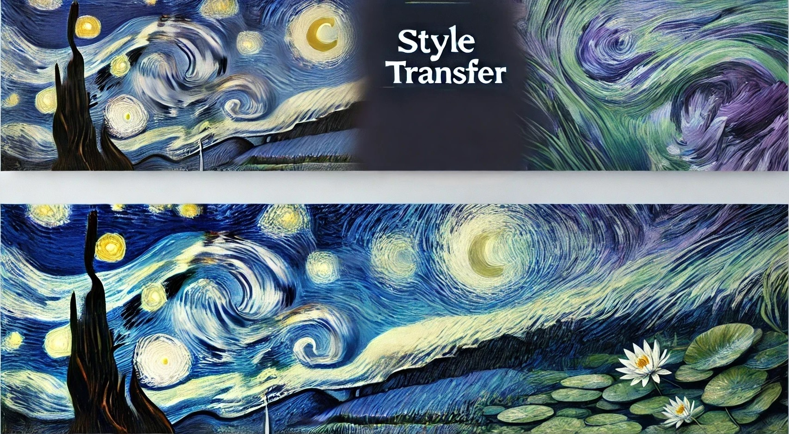

<h1 align="center">Awesome Style Transfer Papers</h1>

<p align="center">
<a href="https://awesome.re">
</a>
</p>

<p align="center">

<p>

A comprehensive collection of research papers, datasets, and resources related to Style Transfer across different domains. From traditional methods to the latest diffusion models, this repository provides a curated list of cutting-edge research in style transfer.

## 📑 Table of Contents

1. [Methods](#methods)
   - [Traditional Methods](#traditional-methods)
   - [GAN-based Methods](#gan-based-methods)
   - [VAE-based Methods](#vae-based-methods)
   - [Diffusion-based Methods](#diffusion-based-methods)

2. [Applications](#applications)
   - [Portrait Style Transfer](#portrait-style-transfer)
   - [Video Style Transfer](#video-style-transfer)
   - [3D Style Transfer](#3d-style-transfer)
   - [Text Style Transfer](#text-style-transfer)
   - [Domain Adaptation](#domain-adaptation)

3. [Datasets](#datasets)
   - [Image Dataset](#image-dataset)
   - [Video Dataset](#video-dataset)
   - [3D Dataset](#3d-dataset)
   - [Text Dataset](#text-dataset)
   - [Domain Dataset](#domain-dataset)


## Methods

### Traditional Methods

| Title | Year | Publish | Paper | Code |
|-------|------|---------|-------|------|
| Arbitrary Style Transfer in Real-time with Adaptive Instance Normalization | 2017 | ICCV | [paper](https://arxiv.org/abs/1703.06868) | [code](https://github.com/xunhuang1995/AdaIN-style) |
| Avatar-Net | 2018 | CVPR | [paper](https://openaccess.thecvf.com/content_cvpr_2018/papers/Sheng_Avatar-Net_Multi-Scale_Zero-Shot_CVPR_2018_paper.pdf) | [code](https://lucassheng.github.io/avatar-net/) |
| AdaAttN | 2021 | ICCV | [paper](https://arxiv.org/pdf/2108.03647) | [code](https://github.com/Huage001/AdaAttN) |
| ArtFlow | 2021 | CVPR | [paper](https://arxiv.org/pdf/2103.16877) | [code](https://github.com/pkuanjie/ArtFlow) |
| CLIPstyler | 2021 | CVPR | [paper](https://arxiv.org/abs/2112.00374) | [code](https://github.com/cyclomon/CLIPstyler) |

### GAN-based Methods

| Title | Year | Publish | Paper | Code |
|-------|------|---------|-------|------|
| Generative Image Modeling using Style and Structure Adversarial Networks | 2016 | - | [paper](https://arxiv.org/abs/1603.05631v2) | - |
| ArtGAN | 2017 | arxiv | [paper](https://arxiv.org/abs/1702.03410) | [code](https://arxiv.org/abs/1702.03410) |
| ComboGAN | 2017 | CVPR | [paper](https://arxiv.org/abs/1712.06909) | - |
| Face Translation between Images and Videos | 2017 | arxiv | [paper](https://arxiv.org/abs/1712.00971) | - |
| MaskGAN | 2018 | ICLR | [paper](https://arxiv.org/abs/1801.07736) | - |
| Perceptually Optimized GAN | 2018 | arXiv | [paper](https://arxiv.org/abs/1805.01084) | - |
| NICE-GAN | 2020 | CVPR | [paper](https://arxiv.org/abs/2003.00273v6) | [code](https://github.com/alpc91/NICE-GAN-pytorch) |
| BlendGAN | 2021 | arXiv | [paper](https://arxiv.org/abs/2110.11728) | - |
| SemanticStyleGAN | 2022 | CVPR | [paper](https://arxiv.org/abs/2112.02236) | - |
| GP-UNIT | 2022 | CVPR | [paper](https://arxiv.org/pdf/2204.03641) | [code](https://github.com/williamyang1991/GP-UNIT) |
| Style-Aware-Discriminator | 2022 | CVPR | [paper](https://arxiv.org/abs/2203.15375) | [code](https://github.com/kunheek/style-aware-discriminator) |
| ISSA | 2023 | arXiv | [paper](https://arxiv.org/abs/2307.00648v1) | [code](https://github.com/boschresearch/ISSA) |
| zGAN | 2024 | - | [paper](https://arxiv.org/abs/2410.20808v2) | - |

### VAE-based Methods

| Title | Year | Publish | Paper | Code |
|-------|------|---------|-------|------|
| WAE | - | - | [paper](https://arxiv.org/abs/1711.01558) | - |
| Representative Feature Extraction During Diffusion Process | 2024 | arXiv | [paper](https://arxiv.org/abs/2401.04362v1) | - |

### Diffusion-based Methods

| Title | Year | Publish | Paper | Code |
|-------|------|---------|-------|------|
| StyleTokenizer | 2024 | ECCV | [paper](https://arxiv.org/pdf/2409.02543) | [code](https://github.com/alipay/style-tokenizer) |
| MagicFace | 2024 | ArXiv | [paper](https://arxiv.org/pdf/2408.07433) | [code](https://github.com/CodeGoat24/MagicFace) |
| SCEPTER | 2024 | ArXiv | [paper](https://arxiv.org/pdf/2404.12154) | [code](https://github.com/modelscope/scepter) |
| B-LoRA | 2024 | ArXiv | [paper](https://arxiv.org/pdf/2403.14572) | [code](https://github.com/yardenfren1996/B-LoRA) |
| CreativeSynth | 2024 | ArXiv | [paper](https://arxiv.org/pdf/2401.14066) | [code](https://github.com/haha-lisa/CreativeSynth) |
| FreeStyle | 2024 | ArXiv | [paper](https://arxiv.org/pdf/2401.15636) | [code](https://github.com/FreeStyleFreeLunch/FreeStyle) |
| InstantID | 2024 | ArXiv | [paper](https://arxiv.org/pdf/2401.07519) | [code](https://github.com/InstantID/InstantID) |
| StyleAligned | 2024 | CVPR | [paper](https://arxiv.org/pdf/2312.02133) | [code](https://github.com/google/style-aligned) |
| StyleID | 2024 | CVPR | [paper](https://arxiv.org/pdf/2312.09008) | [code](https://github.com/jiwoogit/StyleID) |
| Portrait Diffusion | 2023 | ArXiv | [paper](https://arxiv.org/pdf/2312.02212) | [code](https://github.com/liujin112/PortraitDiffusion) |
| ProSpect | 2023 | SIGGRAPH | [paper](https://arxiv.org/pdf/2305.16225) | [code](https://github.com/zyxElsa/ProSpect) |
| InST | 2023 | CVPR | [paper](https://arxiv.org/pdf/2211.13203) | [code](https://github.com/zyxElsa/InST) |

## Applications

### Portrait Style Transfer

| Title | Year | Publish | Paper | Code |
|-------|------|---------|-------|------|
| APDrawingGAN | 2019 | CVPR | [paper](https://openaccess.thecvf.com/content_CVPR_2019/html/Yi_APDrawingGAN_Generating_Artistic_Portrait_Drawings_From_Face_Photos_With_Hierarchical_CVPR_2019_paper.html) | [code](https://github.com/yiranran/APDrawingGAN) |
| WarpGAN | 2020 | CVPR | [paper](https://arxiv.org/abs/1811.10100) | [code](https://github.com/seasonSH/WarpGAN) |
| AiSketcher | 2020 | IROS | [paper](https://ricelll.github.io/AiSketcher/) | [code](https://github.com/fei-aiart/AiSketcher) |
| Cartoon-StyleGAN | 2021 | Arxiv | [paper](https://arxiv.org/abs/2106.12445) | [code](https://github.com/happy-jihye/Cartoon-StyleGAN) |
| SPatchGAN | 2021 | ICCV | [paper](https://arxiv.org/abs/2103.16219) | [code](https://github.com/NetEase-GameAI/SPatchGAN) |
| StyleCariGAN | 2021 | SIGGRAPH | [paper](https://wonjongg.me/StyleCariGAN/) | [code](https://github.com/wonjongg/StyleCariGAN) |
| CariMe | 2021 | TMM | [paper](https://ieeexplore.ieee.org/abstract/document/9454341) | [code](https://github.com/edward3862/CariMe-pytorch) |
| BlendGAN | 2021 | NeurIPS | [paper](https://arxiv.org/abs/2110.11728) | [code](https://github.com/onion-liu/BlendGAN) |
| DynaGAN | 2022 | SIGGRAPH | [paper](https://arxiv.org/pdf/2211.14554) | [code](https://github.com/blueGorae/DynaGAN) |
| TargetCLIP | 2022 | ECCV | [paper](https://arxiv.org/abs/2110.12427) | [code](https://github.com/hila-chefer/TargetCLIP) |
| DCT-Net | 2022 | TOG | [paper](https://arxiv.org/pdf/2207.02426) | [code](https://github.com/menyifang/DCT-Net) |
| GODA | 2022 | NeurIPS | [paper](https://arxiv.org/pdf/2209.03665) | [code](https://github.com/zhangzc21/Generalized-One-shot-GAN-adaptation) |
| Mind the Gap | 2022 | ICLR | [paper](https://arxiv.org/pdf/2110.08398) | [code](https://github.com/ZPdesu/MindTheGap) |
| MMFS | 2023 | PG | [paper](https://arxiv.org/pdf/2305.18009) | [code](https://github.com/mmfs-paper/MMFS) |
| Fix the Noise | 2023 | CVPR | [paper](https://arxiv.org/abs/2303.11545) | [code](https://github.com/LeeDongYeun/FixNoise) |
| SSR-Encoder | 2024 | CVPR | [paper](https://arxiv.org/pdf/2312.16272) | [code](https://github.com/Xiaojiu-z/SSR_Encoder) |
| InstantStyle | 2024 | ArXiv | [paper](https://arxiv.org/pdf/2404.02733) | [code](https://github.com/InstantStyle/InstantStyle) |
| Pair Customization | 2024 | ArXiv | [paper](https://arxiv.org/pdf/2405.01536) | [code](https://github.com/PairCustomization/PairCustomization) |
| ZePo | 2024 | ACM MM | [paper](https://arxiv.org/pdf/2408.05492) | [code](https://github.com/liujin112/ZePo) |
| DoesFS | 2024 | CVPR | [paper](https://arxiv.org/pdf/2403.00459) | [code](https://github.com/zichongc/DoesFS) |

### Video Style Transfer

| Title | Year | Publish | Paper | Code |
|-------|------|---------|-------|------|
| ReCoNet | 2018 | - | [paper](https://arxiv.org/abs/1807.01197) | [code](https://github.com/EmptySamurai/pytorch-reconet) |
| Learning Linear Transformations | 2019 | CVPR | [paper](https://sites.google.com/view/linear-style-transfer-cvpr19/) | [code](https://github.com/sunshineatnoon/LinearStyleTransfer) |
| Layered Neural Atlases | 2021 | - | [paper](https://layered-neural-atlases.github.io/) | [code](https://github.com/ykasten/layered-neural-atlases) |
| VToonify | 2022 | - | [paper](https://arxiv.org/abs/2209.11224) | [code](https://github.com/williamyang1991/VToonify) |
| CCPL | 2022 | - | [paper](https://link.springer.com/chapter/10.1007/978-3-031-19787-1_11) | [code](https://github.com/JarrentWu1031/CCPL) |
| FateZero | 2023 | - | [paper](https://arxiv.org/abs/2303.09535) | [code](https://github.com/chenyangqiqi/fatezero) |
| CAP-VSTNet | 2023 | - | [paper](https://arxiv.org/abs/2303.17867) | [code](https://github.com/linfengWen98/CAP-VSTNet) |
| Control A Video | 2023 | - | [paper](https://arxiv.org/abs/2305.13840) | [code](https://github.com/weifeng-chen/control-a-video) |
| Rerender A Video | 2023 | - | [paper](https://arxiv.org/pdf/2306.07954.pdf) | [code](https://www.mmlab-ntu.com/project/rerender/) |
| Style-A-Video | 2023 | - | [paper](https://arxiv.org/abs/2305.05464) | [code](https://github.com/haha-lisa/Style-A-Video) |
| Hallo1 | 2024 | - | [paper](https://arxiv.org/abs/2406.08801) | [code](https://fudan-generative-vision.github.io/hallo/) |
| Hallo2 | 2024 | - | [paper](https://arxiv.org/abs/2410.07718) | [code](https://fudan-generative-vision.github.io/hallo2/) |
| Hallo3 | 2024 | - | [paper](https://arxiv.org/abs/2412.00733v2) | [code](https://fudan-generative-vision.github.io/hallo3/) |

### 3D Style Transfer

| Title | Year | Publish | Paper | Code |
|-------|------|---------|-------|------|
| RSMT | 2023 | SIGGRAPH | [paper](https://yuyujunjun.github.io/publications/Siggraph2023_RSMT/) | [code](https://github.com/youngseng/diffusestylegesture) |
| DiffuseStyleGesture | 2023 | - | [paper](https://arxiv.org/abs/2305.04919) | [code](https://github.com/youngseng/diffusestylegesture) |
| CAMDM | 2024 | - | [paper](https://arxiv.org/abs/2404.15121) | [code](https://github.com/AIGAnimation/CAMDM) |
| Local Motion Phases | 2022 | - | [paper](https://arxiv.org/abs/2201.04439) | [code](https://github.com/ianxmason/local-phases) |

### Text Style Transfer

| Title | Year | Publish | Paper | Code |
|-------|------|---------|-------|------|
| Sequence to Better Sequence | 2017 | ICML | [paper](http://proceedings.mlr.press/v70/mueller17a.html) | [code](https://bitbucket.org/jwmueller/sequence-to-better-sequence/) |
| Toward Controlled Generation of Text | 2017 | - | [paper](https://arxiv.org/pdf/1703.00955) | [code](https://github.com/asyml/texar) |
| Style Transfer from Non-Parallel Text | 2017 | NeurIPS | [paper](https://papers.nips.cc/paper/7259-style-transfer-from-non-parallel-text-by-cross-alignment.pdf) | [code](https://github.com/shentianxiao/language-style-transfer) |
| Adversarially Regularized Autoencoders | 2018 | - | [paper](https://arxiv.org/pdf/1706.04223) | [code](https://github.com/jakezhaojb/ARAE) |
| Delete, Retrieve, Generate | 2018 | - | [paper](https://arxiv.org/pdf/1804.06437) | [code](https://worksheets.codalab.org/worksheets/0xe3eb416773ed4883bb737662b31b4948/) |
| Style Transfer Through Back-Translation | 2018 | - | [paper](https://arxiv.org/pdf/1804.09000) | [code](https://github.com/shrimai/Style-Transfer-Through-Back-Translation) |
| Disentangled Representation Learning | 2019 | - | [paper](https://arxiv.org/pdf/1808.04339) | [code](https://github.com/vineetjohn/linguistic-style-transfer) |
| Learning Sentiment Memories | 2018 | - | [paper](https://arxiv.org/pdf/1808.07311) | [code](https://github.com/lancopku/SMAE) |
| Unsupervised Controllable Text | 2019 | - | [paper](https://arxiv.org/pdf/1809.04556) | [code](https://github.com/parajain/uctf) |
| Dual Reinforcement Learning | 2019 | - | [paper](https://arxiv.org/pdf/1905.10060) | [code](https://github.com/luofuli/DualLanST) |

### Domain Adaptation

| Title | Year | Publish | Paper | Code |
|-------|------|---------|-------|------|
| One-Shot Domain Adaptation | 2020 | CVPR | [paper](http://openaccess.thecvf.com/content_CVPR_2020/papers/Yang_One-Shot_Domain_Adaptation_for_Face_Generation_CVPR_2020_paper.pdf) | - |
| Meta Face Recognition | 2020 | - | [paper](https://github.com/cleardusk/MFR) | [code](https://github.com/cleardusk/MFR) |
| Cross-Domain Document Detection | 2020 | CVPR | [paper](http://openaccess.thecvf.com/content_CVPR_2020/papers/Li_Cross-Domain_Document_Object_Detection_Benchmark_Suite_and_Method_CVPR_2020_paper.pdf) | [code](https://github.com/kailigo/cddod) |
| StereoGAN | 2020 | CVPR | [paper](http://openaccess.thecvf.com/content_CVPR_2020/papers/Liu_StereoGAN_Bridging_Synthetic-to-Real_Domain_Gap_by_Joint_Optimization_of_Domain_CVPR_2020_paper.pdf) | - |
| Domain Adaptation for Dehazing | 2020 | CVPR | [paper](http://openaccess.thecvf.com/content_CVPR_2020/papers/Shao_Domain_Adaptation_for_Image_Dehazing_CVPR_2020_paper.pdf) | - |
| PointDAN | 2019 | - | [paper](https://arxiv.org/abs/1911.02744v1) | [code](https://github.com/canqin001/PointDAN) |
| GCAN | 2019 | CVPR | [paper](http://openaccess.thecvf.com/content_CVPR_2019/papers/Ma_GCAN_Graph_Convolutional_Adversarial_Network_for_Unsupervised_Domain_Adaptation_CVPR_2019_paper.pdf) | - |
| DCAN | 2020 | - | [paper](https://arxiv.org/abs/2005.06717) | [code](https://github.com/BIT-DA/DCAN) |

## Datasets

### Image Dataset

| Dataset | Year | Size | Description | Link |
|---------|------|------|-------------|------|
| Danbooru2017 | 2017 | 1.9TB, 2.94M images | Anime | [link](https://danbooru.donmai.us/posts?tags=2017) |
| Chinese Style Transfer | 2018 | 1000 content, 100 style images | Chinese Painting | [link](https://github.com/lbsswu/Chinese_style_transfer) |
| Stylized ImageNet | 2018 | ~134GB | Style Transfer | [link](https://github.com/rgeirhos/Stylized-ImageNet) |
| WikiArt | 2018 | 42,129 images | Style, Artist, Genre | [link](https://huggingface.co/datasets/huggan/wikiart) |
| FFHQ | 2019 | 70,000 images | Human Faces | [link](https://github.com/NVlabs/ffhq-dataset) |
| Dark Zurich Dataset | 2019 | 8,779 images | Night, Twilight, Day | [link](https://www.trace.ethz.ch/publications/2019/GCMA_UIoU/) |
| Comic Faces | 2020 | 20K images | Paired Synthetic Comics | [link](https://www.kaggle.com/datasets/defileroff/comic-faces-paired-synthetic-v2) |
| iFakeFaceDB | 2020 | 87,000 images | Face Images | [link](https://github.com/socialabubi/iFakeFaceDB) |
| Ukiyo-e Faces | 2020 | 5,209 images | Aligned Ukiyo-e Faces | [link](https://www.justinpinkney.com/blog/2020/ukiyoe-dataset/) |
| DFFD | 2020 | 299,039 images | Face Manipulation | [link](https://cvlab.cse.msu.edu/dffd-dataset.html) |
| MetFaces | 2020 | 1,336 images | Artistic Faces | [link](https://github.com/NVlabs/metfaces-dataset) |
| AAHQ | 2021 | 25,000 images | Artistic Faces | [link](https://github.com/onion-liu/aahq-dataset) |
| StyleGAN Human | 2022 | 40K+ images | Human Generation | [link](https://stylegan-human.github.io/) |
| DiffusionDB | 2022 | 14M images | Text-to-image | [link](https://github.com/poloclub/diffusiondb) |
| 4SKST | 2023 | 25 color, 100 sketches | Sketch Style | [link](https://github.com/Chanuku/4skst) |
| JourneyDB | 2023 | 4.4M images | Multimodal Vision | [link](https://journeydb.github.io/) |
| DiffusionFace | 2024 | 600,000 images | Face Forgery | [link](https://github.com/Rapisurazurite/DiffFace) |
| Trailer Faces HQ | 2024 | 187K faces | Facial Expressions | [link](https://www.justinpinkney.com/blog/2024/trailer-faces/) |
| StyleShot | 2024 | - | Style Transfer | [link](https://styleshot.github.io/) |

### Video Dataset

| Dataset | Year | Size | Description | Link |
|---------|------|------|-------------|------|
| UADFV | 2018 | 100 videos | Video Style Transfer | [link](https://arxiv.org/abs/1811.00661) |
| Deepfake-TIMIT | 2018 | 960 videos | Face Recognition | [link](https://conradsanderson.id.au/vidtimit/) |
| DFFD | 2019 | 300 videos | Diverse Fake Face | [link](https://cvlab.cse.msu.edu/dffd-dataset.html) |
| Celeb-DF | 2020 | 408 original videos | DeepFake | [link](https://github.com/yuezunli/celeb-deepfakeforensics) |
| DFDC | 2020 | 100,000 clips | DeepFake Detection | [link](https://www.kaggle.com/c/deepfake-detection-challenge) |
| FaceForensics++ | 2019 | 6000 videos | Swapped Face | [link](https://github.com/ondyari/FaceForensics) |
| ForgeryNet | 2021 | 221,247 videos | Forgery Analysis | [link](https://github.com/yinanhe/forgerynet) |
| FFIW-10K | 2021 | 10,000 videos | Face Forgery | [link](https://github.com/tfzhou/FFIW) |
| Wild Deepfake | 2024 | 7,314 sequences | Deepfake Detection | [link](https://github.com/OpenTAI/wild-deepfake) |

### 3D Dataset

| Dataset | Year | Size | Description | Link |
|---------|------|------|-------------|------|
| 100STYLE | 2022 | 4M frames | Stylized Motion Capture | [link](https://zenodo.org/records/8127870) |
| Motiondataset | 2023 | 36,673 frames | 3D Motion | [link](https://github.com/BandaiNamcoResearchInc/Bandai-Namco-Research-Motiondataset) |

### Text Dataset

| Dataset | Year | Size | Description | Link |
|---------|------|------|-------------|------|
| Touchdown | 2020 | 9,326 instructions | Navigation | [link](https://github.com/lil-lab/touchdown) |
| Yelp | 2020 | 6.99M comments | NLP Corpus | [link](https://www.yelp.com/dataset) |
| YAFC Corpus | 2018 | Largest stylistic corpus | Style Transfer | [link](https://github.com/raosudha89/GYAFC-corpus) |
| ParaDetox | 2020 | 10,000 toxic sentences | Detoxification | [link](https://github.com/s-nlp/paradetox) |


## Contributing

We welcome contributions! Here's how you can help:

- 🐛 Report bugs and issues
- 💡 Suggest new papers or resources
- 🔧 Submit pull requests
- ⭐ Star this repository if you find it helpful!

Feel free to open an issue or submit a pull request if you:
- Have any suggestions or corrections
- Want to add new papers or resources
- Find any broken links

## Citation

If you find this repository useful for your research, please consider citing:

```bibtex

```

## Star History

[](https://star-history.com/#neptune-T/Awesome-Style-Transfer&Date)

## Acknowledgments

Thanks to all researchers and developers who made their work publicly available.

<p align="center">

</p>

<div align="center">
  <sub>By Monet's Impression of Sunrise</sub>
</div>
