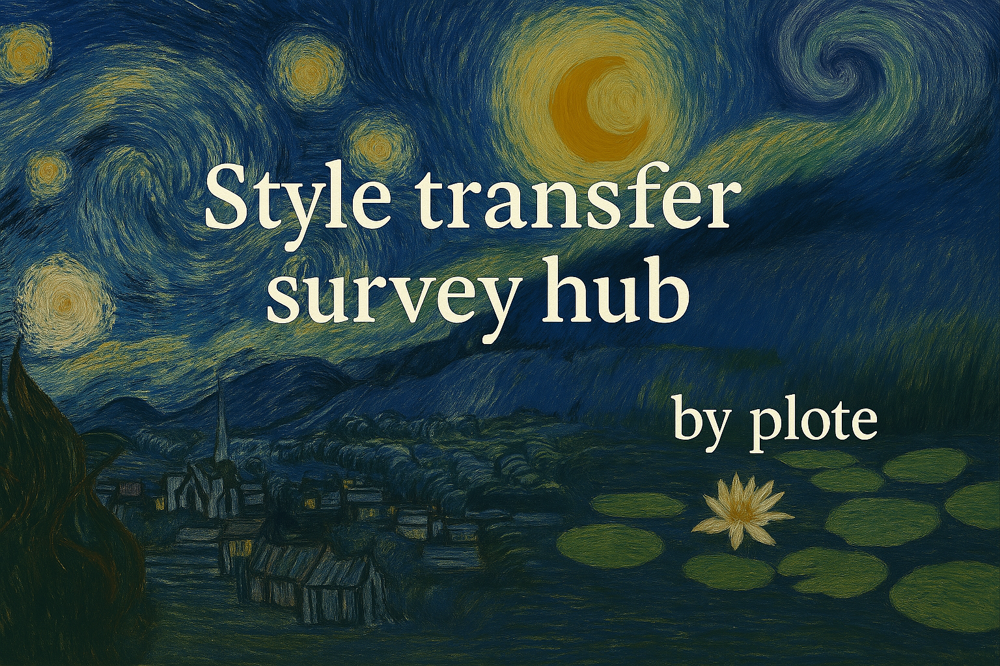
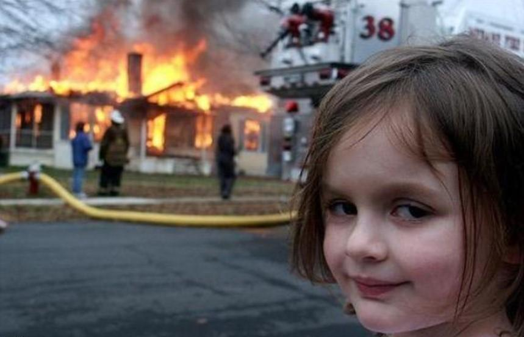
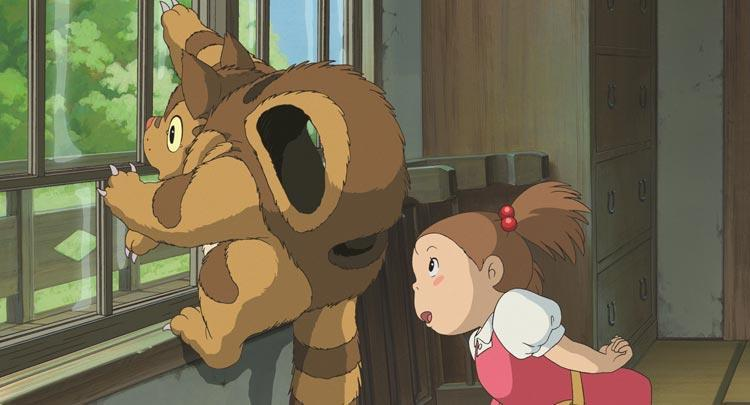
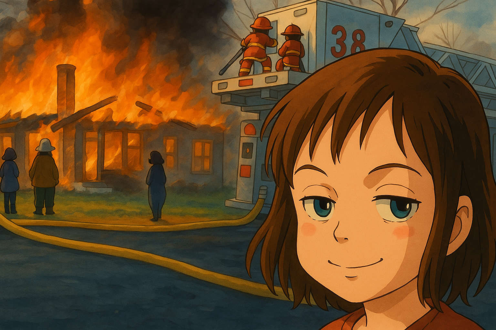

<div align="center">

# Awesome Style Transfer Papers

<p align="center">
  
</p>

[](https://awesome.re)

[](https://github.com/neptune-T/Awesome-Style-Transfer)
[](https://arxiv.org/abs/2506.19278)
[](https://github.com/neptune-T/Awesome-Style-Transfer)
[](https://opensource.org/licenses/MIT)
[](https://github.com/neptune-T/Awesome-Style-Transfer)

<p align="center">
    <a href="#methods">Methods</a> |
    <a href="#applications">Applications</a> |
    <a href="#datasets">Datasets</a> |
    <a href="#contributing">Contributing</a>
</p>

</div>

## 🎨 About This Repository

A collection of research papers, datasets, and resources related to Style Transfer across various domains. This repository offers a curated list of methods, from traditional techniques to the more recent diffusion models, to provide insights into the ongoing advancements in style transfer.

##  Style Transfer Examples

<div align="center">
<table>
  <tr>
    <th>Content Image</th>
    <th>Style Image</th>
    <th>Transferred Result</th>
  </tr>
  <tr>
    <td></td>
    <td></td>
    <td></td>
  </tr>
  <tr>
    <td><em>Disaster Girl</em></td>
    <td><em>となりのトトロ</em></td>
    <td><em>Transferred Result</em></td>
  </tr>
</table>
</div>


> *From:ChatGPT 4o*

### Key Features:

- 📚 **Traditional Methods**: Neural style transfer and its variants
- 🖼️ **GAN-based Methods**: Generative approaches for style transfer
- 🎯 **VAE-based Methods**: Variational methods for style manipulation  
- 🌟 **Diffusion-based Methods**: Latest advances in diffusion models
- 📊 **Applications**: Portrait, Video, 3D, Text style transfer
- 💾 **Datasets**: Curated datasets for style transfer research


## 📑 Table of Contents

1. [Methods](#methods)
   - [Traditional Methods](#traditional-methods)
   - [GAN-based Methods](#gan-based-methods)
   - [VAE-based Methods](#vae-based-methods)
   - [Diffusion-based Methods](#diffusion-based-methods)

2. [Applications](#applications)
   - [Portrait Style Transfer](#portrait-style-transfer)
   - [Video Style Transfer](#video-style-transfer)
   - [3D Style Transfer](#3d-style-transfer)
   - [Text Style Transfer](#text-style-transfer)
   - [Domain Adaptation](#domain-adaptation)

3. [Datasets](#datasets)
   - [Image Dataset](#image-dataset)
   - [Video Dataset](#video-dataset)
   - [3D Dataset](#3d-dataset)
   - [Text Dataset](#text-dataset)
   - [Domain Dataset](#domain-dataset)
   - [Data Augmentation](#data-augmentation)

## Methods

### Traditional Methods
| Title | Year | Publish | Paper | Code |
|-------|------|---------|-------|------|
| Neural Style Transfer (NST) | 2015 | CVPR | [paper](https://arxiv.org/abs/1508.06576) | - |
| Fast Style Transfer | 2016 | ECCV | [paper](https://arxiv.org/abs/1603.08155) | [code](https://github.com/lengstrom/fast-style-transfer) |
| Texture Net | 2016 | arXiv | [paper](https://arxiv.org/abs/1603.03417) | [code](https://github.com/DmitryUlyanov/texture-nets) |
| Instance Normalization | 2016 | arXiv | [paper](https://arxiv.org/abs/1607.08022) | [code](https://github.com/CellEight/Pytorch-Adaptive-Instance-Normalization) |
| Universal Style Transfer | 2017 | NIPS | [paper](https://arxiv.org/abs/1705.08086) | - |
| Light-weight Style Transfer | 2017 | CVPR | [paper](https://arxiv.org/abs/1701.02096) | [code](https://github.com/DmitryUlyanov/texture_nets) |
| Arbitrary Style Transfer in Real-time with Adaptive Instance Normalization | 2017 | ICCV | [paper](https://arxiv.org/abs/1703.06868) | [code](https://github.com/xunhuang1995/AdaIN-style) |
| Histogram Loss | 2017 | CVPR | [paper]() | [code]() |
| Multimodal Style Transfer (AdaIN Extension) | 2018 | CVPR | [paper]() | [code]() |
| Avatar-Net | 2018 | CVPR | [paper](https://openaccess.thecvf.com/content_cvpr_2018/papers/Sheng_Avatar-Net_Multi-Scale_Zero-Shot_CVPR_2018_paper.pdf) | [code](https://lucassheng.github.io/avatar-net/) |
| NST-MetaNet | 2018 | CVPR |  | - |
| AMST | 2019 | CVPR | [paper](https://arxiv.org/abs/1901.05127) | - |
| SEAN | 2020 | CVPR | [paper](https://arxiv.org/abs/1903.07291) | [code](https://github.com/NVlabs/SPADE) |
| AdaAttN | 2021 | ICCV | [paper](https://arxiv.org/pdf/2108.03647) | [code](https://github.com/Huage001/AdaAttN) |
| ArtFlow | 2021 | CVPR | [paper](https://arxiv.org/pdf/2103.16877) | [code](https://github.com/pkuanjie/ArtFlow) |
| CLIPstyler | 2021 | CVPR | [paper](https://arxiv.org/abs/2112.00374) | [code](https://github.com/cyclomon/CLIPstyler) |
| Style Transfer by Rigid Alignment in Neural Net Feature Space | 2021 | CVPR | [paper](https://openaccess.thecvf.com/content/WACV2021/papers/Hada_Style_Transfer_by_Rigid_Alignment_in_Neural_Net_Feature_Space_WACV_2021_paper.pdf) | - |
| Content and style disentanglement for artistic style transfer | 2022 | ICCV | [paper](https://openaccess.thecvf.com/content_ICCV_2019/papers/Kotovenko_Content_and_Style_Disentanglement_for_Artistic_Style_Transfer_ICCV_2019_paper.pdf) | [code](https://github.com/CompVis/content-style-disentangled-ST) |
| Region-controlled Style Transfer | 2023 | arXiv | [paper](https://arxiv.org/abs/2310.15658) | - |
| Optimal Image Transport on Sparse Dictionaries | 2023 | arXiv | [paper](https://arxiv.org/abs/2311.01984) | - |
| Puff-Net: Efficient Style Transfer with Pure Content and Style Feature Fusion Network | 2024 | CVPR | [paper](https://arxiv.org/html/2405.19775v1) | [code](https://github.com/ZszYmy9/Puff-Net) |
| S2WAT: Image Style Transfer via Hierarchical Vision Transformer using Strips Window Attention | 2024 | AAAI | [paper](https://github.com/AlienZhang1996/S2WAT) | [code](https://github.com/AlienZhang1996/S2WAT) |
| Extending user control for image stylization using hierarchical style transfer networks | 2024 | Heliyon | [paper](https://www.sciencedirect.com/science/article/pii/S2405844024030433) | - |
| Relu-oscillator: Chaotic vgg10 model for real-time neural style transfer on painting au- thentication | 2024 | ESWA | [paper](https://www.sciencedirect.com/science/article/abs/pii/S0957417424013770) | - |
| AEANet: Affinity Enhanced Attentional Networks for Arbitrary Style Transfer | 2024 | arXiv | [paper](https://arxiv.org/abs/2409.14652) | - |
| Artistic Neural Style Transfer Algorithms with Activation Smoothing | 2024 | arXiv | [paper](https://arxiv.org/abs/2411.08014) | - |
| StyleMamba | 2024 | arXiv | [paper](https://arxiv.org/abs/2405.05027) |[code](https://github.com/OliverDOU776/StyleMamba) |

### GAN-based Methods


| Title | Year | Publish | Paper | Code |
|-------|------|---------|-------|------|
| GAN | 2014 | NeurIPS | [paper](https://arxiv.org/abs/1406.2661) | - |
| DCGAN | 2015 | ICLR | [paper](https://arxiv.org/abs/1511.06434) | - |
| LAPGAN | 2015 | ICML | [paper](https://arxiv.org/abs/1506.05751) | - |
| ImprovedGAN | 2016 | NeurIPS | [paper](https://arxiv.org/abs/1606.03498) | - |
| EBGAN | 2016 | arXiv | [paper](https://arxiv.org/abs/1609.03126) | - |
| VideoGAN | 2016 | NeurIPS | [paper](https://arxiv.org/abs/1609.02612) | - |
| InfoGAN | 2016 | NeurIPS | [paper](https://arxiv.org/abs/1606.03657) | - |
| CycleGAN | 2017 | ICCV | [paper](https://arxiv.org/abs/1703.10593) | [code](https://github.com/junyanz/CycleGAN) |
| PGGAN | 2017 | ICLR | [paper](https://arxiv.org/abs/1710.10196) | - |
| WGAN | 2017 | ICML | [paper](https://arxiv.org/abs/1701.07875) | - |
| LSGAN | 2017 | ICCV | [paper](https://arxiv.org/abs/1611.04076) | - |
| BEGAN | 2017 | ICLR | [paper](https://arxiv.org/abs/1703.10717) | - |
| Pix2Pix | 2017 | CVPR | [paper](https://arxiv.org/abs/1611.07004) | [code](https://github.com/phillipi/pix2pix) |
| FID-GAN | 2017 | NeurIPS | [paper](https://arxiv.org/abs/1706.08500) | - |
| DualGAN | 2017 | ICCV | [paper](https://arxiv.org/abs/1704.02510) | - |
| SeqGAN | 2017 | AAAI | [paper](https://arxiv.org/abs/1609.05473) | - |
| SRGAN | 2017 | CVPR | [paper](https://arxiv.org/abs/1609.04802) | - |
| ArtGAN | 2017 | arxiv | [paper](https://arxiv.org/abs/1702.03410) | [code](https://arxiv.org/abs/1702.03410) |
| ComboGAN | 2017 | CVPR | [paper](https://arxiv.org/abs/1712.06909) | - |
| Identity-aware CycleGAN | 2017 | arXiv | [paper](https://arxiv.org/abs/1712.00971) | - |
| PoseNormGAN | 2017 | ECCV | [paper](https://arxiv.org/abs/1712.02225) | - |
| BigGAN | 2018 | ICLR | [paper](https://arxiv.org/abs/1809.11096) | [code](https://github.com/ajbrock/BigGAN-PyTorch) |
| GANimation | 2018 | ECCV | [paper](https://arxiv.org/abs/1807.09251) | - |
| PacGAN | 2018 | NeurIPS | [paper](https://arxiv.org/abs/1712.04086) | - |
| RecycleGAN | 2018 | CVPR | [paper](https://arxiv.org/abs/1808.05174) | - |
| StarGAN | 2018 | CVPR | [paper](https://arxiv.org/abs/1711.09020) | [code](https://github.com/yunjey/StarGAN) |
| MaskGAN | 2018 | ICLR | [paper](https://arxiv.org/abs/1801.07736) | - |
| POGAN-Dehaze | 2018 | arXiv | [paper](https://arxiv.org/abs/1805.01084) | - |
| ChipGAN | 2018 | ACM | [paper](https://dl.acm.org/doi/10.1145/3240508.3240655) | - |
| StyleGAN | 2019 | CVPR | [paper](https://arxiv.org/abs/1812.04948) | [code](https://github.com/NVlabs/stylegan) |
| GANPaint | 2019 | SIGGRAPH | [paper](https://arxiv.org/abs/1903.07392) | - |
| SinGAN | 2019 | ICCV | [paper](https://arxiv.org/abs/1905.01164) | [code](https://github.com/tamarott/SinGAN) |
| SAGAN | 2019 | ICML | [paper](https://arxiv.org/abs/1805.08318) | - |
| StyleGAN2 | 2020 | CVPR | [paper](https://arxiv.org/abs/1912.04958) | [code](https://github.com/NVlabs/stylegan2) |
| ConSinGAN | 2020 | CVPR | [paper](https://arxiv.org/abs/2003.11512) | [code](https://github.com/tohinz/ConSinGAN) |
| PaintGAN | 2020 | ECCV | [paper](https://arxiv.org/abs/2008.05775) | - |
| TecoGAN | 2020 | ICLR | [paper](https://arxiv.org/abs/1811.09393) | [code](https://github.com/thunil/TecoGAN) |
| U-GAT-IT | 2020 | ICLR | [paper](https://arxiv.org/abs/1907.10830) | [code](https://github.com/taki0112/UGATIT) |
| NICE-GAN | 2020 | CVPR | [paper](https://arxiv.org/abs/2003.00273v6) | [code](https://github.com/alpc91/NICE-GAN-pytorch) |
| White-box-Cartoonization | 2020 | CVPR | [paper](https://openaccess.thecvf.com/content_CVPR_2020/papers/Wang_Learning_to_Cartoonize_Using_White-Box_Cartoon_Representations_CVPR_2020_paper.pdf) | [code](https://github.com/SystemErrorWang/White-box-Cartoonization) |
| E2ECP | 2020 | CVPR | [paper](https://arxiv.org/abs/2003.11258) | - |
| StyleGAN3 | 2021 | NeurIPS | [paper](https://arxiv.org/abs/2106.12423) | [code](https://github.com/NVlabs/stylegan3) |
| GANformer | 2021 | CVPR | [paper](https://arxiv.org/abs/2103.01209) | - |
| FastGAN | 2021 | arXiv | [paper](https://arxiv.org/abs/2101.04775) | - |
| BlendGAN | 2021 | arXiv | [paper](https://arxiv.org/abs/2110.11728) | - |
| CoModGAN | 2021 | CVPR | [paper](https://arxiv.org/abs/2102.04432) | [code](https://github.com/zsyzzsoft/co-mod-gan) |
| StyleSwin | 2022 | CVPR | [paper](https://arxiv.org/abs/2112.10762) | - |
| SemanticStyleGAN | 2022 | CVPR | [paper](https://arxiv.org/abs/2112.02236) | - |
| InstGAN | 2022 | CVPR | [paper](https://arxiv.org/abs/2111.13800) | - |
| Style-Aware-Discriminator | 2022 | CVPR | [paper](https://arxiv.org/abs/2203.15375) | [code](https://github.com/kunheek/style-aware-discriminator) |
| GP-UNIT | 2022 | CVPR | [paper](https://arxiv.org/pdf/2204.03641) | [code](https://github.com/williamyang1991/GP-UNIT) |
| GigaGAN | 2023 | CVPR | [paper](https://arxiv.org/abs/2303.05511) | [code](https://github.com/NVlabs/gigagan) |
| CLCAE | 2023 | CVPR | [paper](https://arxiv.org/abs/2303.12641) | - |
| DeltaEdit | 2023 | CVPR | [paper](https://arxiv.org/abs/2303.06285) | [code](https://github.com/Yueming6568/DeltaEdit) |
| NoisyTwins | 2023 | CVPR | [paper](https://arxiv.org/abs/2303.08133) | - |
| AdaptiveMix | 2023 | CVPR | [paper](https://arxiv.org/abs/2212.10543) | - |
| CREPS | 2023 | CVPR | [paper](https://arxiv.org/abs/2303.11413) | - |
| CoralStyleCLIP | 2023 | CVPR | [paper](https://arxiv.org/abs/2303.14343) | - |
| ISSA | 2023 | arXiv | [paper](https://arxiv.org/abs/2307.00648v1) | [code](https://github.com/boschresearch/ISSA) |
| zGAN | 2024 | arXiv | [paper](https://arxiv.org/abs/2410.20808v2) | - |
| mmist | 2024 | WACV | [paper](https://arxiv.org/abs/2311.00813) | - |
| CCST-GAN | 2024 | ICIP | [paper](https://ieeexplore.ieee.org/document/10586662) | - |
| JPSF-SD-ControlNet | 2024 | arXiv | [paper](https://arxiv.org/abs/2401.08740) | - |
| MRStyle | 2024 | arXiv | [paper](https://arxiv.org/abs/2401.09853) | - |

### VAE-based Methods

| Title | Year | Publish | Paper | Code |
|-------|------|---------|-------|------|
| VAE | 2013 | ICLR | [paper](https://arxiv.org/abs/1312.6114) | - |
| Conditional VAE (CVAE) | 2015 | NeurIPS | [paper](https://papers.nips.cc/paper/2015/hash/8d55a249e6baa5c06772297520da2051-Abstract.html) | - |
| Hierarchical VAE | 2016 | NeurIPS | [paper](https://arxiv.org/abs/1602.02282) | - |
| β-VAE | 2017 | ICLR | [paper](https://openreview.net/forum?id=Sy2fzU9gl) | - |
| VQ-VAE | 2017 | NeurIPS | [paper](https://arxiv.org/abs/1711.00937) | - |
| InfoVAE (MMD-VAE) | 2017 | arXiv | [paper] | - |
| WAE | 2017 | ICLR | [paper] | - |
| FactorVAE | 2018 | ICML | [paper] | - |
| DIP-VAE | 2018 | ICLR | [paper] | - |
| β-TCVAE | 2018 | ICML | [paper] | - |
| BigVAE | 2019 | ICLR | [paper] | - |
| VQ-VAE-2 | 2019 | NeurIPS | [paper] | - |
| NVAE | 2020 | NeurIPS | [paper] | - |
| Parallel VAE | 2020 | ICML | [paper] | - |
| StyleVAE | 2021 | CVPR | [paper] | - |
| Score-VAE | 2021 | NeurIPS | [paper] | - |
| Distilled-VAE | 2022 | ICML | [paper] | - |
| Masked-VAE | 2023 | CVPR | [paper] | - |
| DynamicVAE | 2023 | AAAI | [paper]| - |
| RFE-DiffSketch | 2024 | arXiv | [paper] | - |

### Diffusion-based Methods

| Title | Year | Publish | Paper | Code |
|-------|------|---------|-------|------|
| DDIM | 2020 | NeurIPS | [paper](https://arxiv.org/abs/2010.02502) | [code](https://github.com/ermongroup/ddim) |
| IDDPM | 2021 | ICML | [paper](https://arxiv.org/abs/2102.09672) | - |
| SBGMLS | 2021 | NeurIPS | [paper](https://arxiv.org/abs/2106.01565) | - |
| SBGM-SDE | 2021 | ICML | [paper](https://arxiv.org/abs/2011.13456) | - |
| MLT-SBDM | 2021 | NeurIPS | [paper](https://arxiv.org/abs/2101.11859) | - |
| SDDMDSS | 2021 | NeurIPS | [paper](https://arxiv.org/abs/2107.00630) | - |
| DiffusionCLIP | 2022 | CVPR | [paper](https://arxiv.org/abs/2110.02711) | [code](https://github.com/gwang-kim/DiffusionCLIP) |
| HRIS-LDM | 2022 | CVPR | [paper](https://arxiv.org/abs/2112.10752) | [code](https://github.com/CompVis/latent-diffusion) |
| DPM-Solver | 2022 | NeurIPS | [paper](https://arxiv.org/abs/2206.00927) | [code](https://github.com/LuChengTHU/dpm-solver) |
| SBGM-CDLD | 2022 | - | - | - |
| VQDM-TIS | 2022 | CVPR | - | - |
| CCDF-SC | 2022 | CVPR | - | - |
| PNM-DMM | 2022 | - | - | - |
| ASM-ISIG | 2022 | - | - | - |
| StyleDiffusion | 2023 | - | [paper](https://arxiv.org/abs/2303.09268) | - |
| gDDIM | 2023 | - | [paper](https://arxiv.org/abs/2306.04848) | - |
| FS-DM-EI | 2023 | - | - | - |
| DACDM | 2023 | - | - | - |
| StyleID | 2023 | - | [paper](https://arxiv.org/abs/2312.09008) | [code](https://github.com/jiwoogit/StyleID) |
| PortraitDiff | 2024 | - | [paper](https://arxiv.org/abs/2312.02212) | [code](https://github.com/liujin112/PortraitDiffusion) |
| CMCDM | 2024 | - | - | - |
| SGAT-DM | 2024 | - | - | - |
| CFM-Velocity | 2024 | - | - | - |
| ADM-MP | 2024 | - | - | - |
| HEDSDM | 2024 | - | - | - |
| SLDM | 2024 | - | - | - |
| REDAP | 2024 | - | - | - |
| ARTID | 2024 | - | - | - |
| TiNO-Edit | 2024 | - | - | - |
| IDIS-CP | 2024 | - | - | - |
| SCEPTER | 2024 | - | [paper](https://arxiv.org/abs/2404.12154) | [code](https://github.com/modelscope/scepter) |
| MagicFace | 2024 | - | [paper](https://arxiv.org/abs/2408.07433) | [code](https://github.com/CodeGoat24/MagicFace) |
| InstantID | 2024 | - | [paper](https://arxiv.org/abs/2401.07519) | [code](https://github.com/InstantID/InstantID) |
| CreativeSynth | 2024 | - | [paper](https://arxiv.org/abs/2401.14066) | [code](https://github.com/haha-lisa/CreativeSynth) |
| B-LoRA | 2024 | - | [paper](https://arxiv.org/abs/2403.14572) | [code](https://github.com/yardenfren1996/B-LoRA) |
| DEADiff | 2024 | - | - | - |
| DRL | 2024 | - | - | - |
| StyleTokenizer | 2024 | - | [paper](https://arxiv.org/abs/2409.02543) | [code](https://github.com/alipay/style-tokenizer) |
| PFGM | 2022 | NeurIPS | [paper](https://arxiv.org/abs/2209.11178) | - |
| VP-DGM-SM | 2021 | ICLR | [paper](https://arxiv.org/abs/2101.03288) | - |
| Frido-FPD | 2022 | - | [paper](https://arxiv.org/abs/2208.12446) | - |
| GLIDE | 2022 | ICLR | [paper](https://arxiv.org/abs/2112.10741) | - |
| DreamBooth | 2023 | ICLR | [paper](https://arxiv.org/abs/2208.12242) | [code](https://github.com/XavierXiao/Dreambooth-Stable-Diffusion) |
| UniTune | 2023 | - | [paper](https://arxiv.org/abs/2306.12423) | - |
| RealCompo | 2024 | - | [paper](https://arxiv.org/abs/2401.12868) | - |
| EditWorld | 2024 | - | [paper](https://arxiv.org/abs/2403.06392) | - |
| IterComp | 2024 | - | [paper](https://arxiv.org/abs/2402.05408) | - |
| AdaptiveDiffusion | 2024 | - | [paper](https://arxiv.org/abs/2401.05356) | - |
| Step-Adaptive Training | 2024 | - | [paper](https://arxiv.org/abs/2401.05146) | - |
| AdaDiff | 2024 | - | [paper](https://arxiv.org/abs/2401.14902) | - |
| MDT | 2024 | - | [paper](https://arxiv.org/abs/2401.12077) | - |
| U-ViT | 2023 | - | [paper](https://arxiv.org/abs/2307.15979) | - |
| DiffiT | 2024 | - | [paper](https://arxiv.org/abs/2401.10568) | - |
| FastDiff 2 | 2023 | - | [paper](https://arxiv.org/abs/2311.11545) | - |
| HLDM-TFIST | 2024 | - | [paper](https://arxiv.org/abs/2401.11605) | - |
| ZeroShotCL | 2023 | - | [paper](https://arxiv.org/abs/2312.12419) | - |
| MTID-MLLM | 2024 | - | [paper](https://arxiv.org/abs/2401.11708) | - |
| MUMU | 2024 | - | [paper](https://arxiv.org/abs/2401.09711) | - |
| Rectified Diffusion | 2024 | - | [paper](https://arxiv.org/abs/2402.02009) | - |

## Applications

### Portrait Style Transfer

| Title | Year | Publish | Paper | Code |
|-------|------|---------|-------|------|
| APDrawingGAN | 2019 | CVPR | [paper](https://openaccess.thecvf.com/content_CVPR_2019/html/Yi_APDrawingGAN_Generating_Artistic_Portrait_Drawings_From_Face_Photos_With_Hierarchical_CVPR_2019_paper.html) | [code](https://github.com/yiranran/APDrawingGAN) |
| WarpGAN | 2020 | CVPR | [paper](https://arxiv.org/abs/1811.10100) | [code](https://github.com/seasonSH/WarpGAN) |
| AiSketcher | 2020 | IROS | [paper](https://ricelll.github.io/AiSketcher/) | [code](https://github.com/fei-aiart/AiSketcher) |
| Cartoon-StyleGAN | 2021 | Arxiv | [paper](https://arxiv.org/abs/2106.12445) | [code](https://github.com/happy-jihye/Cartoon-StyleGAN) |
| SPatchGAN | 2021 | ICCV | [paper](https://arxiv.org/abs/2103.16219) | [code](https://github.com/NetEase-GameAI/SPatchGAN) |
| StyleCariGAN | 2021 | SIGGRAPH | [paper](https://wonjongg.me/StyleCariGAN/) | [code](https://github.com/wonjongg/StyleCariGAN) |
| CariMe | 2021 | TMM | [paper](https://ieeexplore.ieee.org/abstract/document/9454341) | [code](https://github.com/edward3862/CariMe-pytorch) |
| BlendGAN | 2021 | NeurIPS | [paper](https://arxiv.org/abs/2110.11728) | [code](https://github.com/onion-liu/BlendGAN) |
| DynaGAN | 2022 | SIGGRAPH | [paper](https://arxiv.org/pdf/2211.14554) | [code](https://github.com/blueGorae/DynaGAN) |
| TargetCLIP | 2022 | ECCV | [paper](https://arxiv.org/abs/2110.12427) | [code](https://github.com/hila-chefer/TargetCLIP) |
| DCT-Net | 2022 | TOG | [paper](https://arxiv.org/pdf/2207.02426) | [code](https://github.com/menyifang/DCT-Net) |
| GODA | 2022 | NeurIPS | [paper](https://arxiv.org/pdf/2209.03665) | [code](https://github.com/zhangzc21/Generalized-One-shot-GAN-adaptation) |
| Mind the Gap | 2022 | ICLR | [paper](https://arxiv.org/pdf/2110.08398) | [code](https://github.com/ZPdesu/MindTheGap) |
| MMFS | 2023 | PG | [paper](https://arxiv.org/pdf/2305.18009) | [code](https://github.com/mmfs-paper/MMFS) |
| Fix the Noise | 2023 | CVPR | [paper](https://arxiv.org/abs/2303.11545) | [code](https://github.com/LeeDongYeun/FixNoise) |
| SSR-Encoder | 2024 | CVPR | [paper](https://arxiv.org/pdf/2312.16272) | [code](https://github.com/Xiaojiu-z/SSR_Encoder) |
| InstantStyle | 2024 | ArXiv | [paper](https://arxiv.org/pdf/2404.02733) | [code](https://github.com/InstantStyle/InstantStyle) |
| Pair Customization | 2024 | ArXiv | [paper](https://arxiv.org/pdf/2405.01536) | [code](https://github.com/PairCustomization/PairCustomization) |
| ZePo | 2024 | ACM MM | [paper](https://arxiv.org/pdf/2408.05492) | [code](https://github.com/liujin112/ZePo) |
| DoesFS | 2024 | CVPR | [paper](https://arxiv.org/pdf/2403.00459) | [code](https://github.com/zichongc/DoesFS) |

### Video Style Transfer

| Title | Year | Publish | Paper | Code |
|-------|------|---------|-------|------|
| ReCoNet | 2018 | - | [paper](https://arxiv.org/abs/1807.01197) | [code](https://github.com/EmptySamurai/pytorch-reconet) |
| Learning Linear Transformations | 2019 | CVPR | [paper](https://sites.google.com/view/linear-style-transfer-cvpr19/) | [code](https://github.com/sunshineatnoon/LinearStyleTransfer) |
| Layered Neural Atlases | 2021 | - | [paper](https://layered-neural-atlases.github.io/) | [code](https://github.com/ykasten/layered-neural-atlases) |
| VToonify | 2022 | - | [paper](https://arxiv.org/abs/2209.11224) | [code](https://github.com/williamyang1991/VToonify) |
| CCPL | 2022 | - | [paper](https://link.springer.com/chapter/10.1007/978-3-031-19787-1_11) | [code](https://github.com/JarrentWu1031/CCPL) |
| FateZero | 2023 | - | [paper](https://arxiv.org/abs/2303.09535) | [code](https://github.com/chenyangqiqi/fatezero) |
| CAP-VSTNet | 2023 | - | [paper](https://arxiv.org/abs/2303.17867) | [code](https://github.com/linfengWen98/CAP-VSTNet) |
| Control A Video | 2023 | - | [paper](https://arxiv.org/abs/2305.13840) | [code](https://github.com/weifeng-chen/control-a-video) |
| Rerender A Video | 2023 | - | [paper](https://arxiv.org/pdf/2306.07954.pdf) | [code](https://www.mmlab-ntu.com/project/rerender/) |
| Style-A-Video | 2023 | - | [paper](https://arxiv.org/abs/2305.05464) | [code](https://github.com/haha-lisa/Style-A-Video) |
| Hallo1 | 2024 | - | [paper](https://arxiv.org/abs/2406.08801) | [code](https://fudan-generative-vision.github.io/hallo/) |
| Hallo2 | 2024 | - | [paper](https://arxiv.org/abs/2410.07718) | [code](https://fudan-generative-vision.github.io/hallo2/) |
| Hallo3 | 2024 | - | [paper](https://arxiv.org/abs/2412.00733v2) | [code](https://fudan-generative-vision.github.io/hallo3/) |

### 3D Style Transfer

| Title | Year | Publish | Paper | Code |
|-------|------|---------|-------|------|
| RSMT | 2023 | SIGGRAPH | [paper](https://yuyujunjun.github.io/publications/Siggraph2023_RSMT/) | [code](https://github.com/youngseng/diffusestylegesture) |
| DiffuseStyleGesture | 2023 | - | [paper](https://arxiv.org/abs/2305.04919) | [code](https://github.com/youngseng/diffusestylegesture) |
| CAMDM | 2024 | - | [paper](https://arxiv.org/abs/2404.15121) | [code](https://github.com/AIGAnimation/CAMDM) |
| Local Motion Phases | 2022 | - | [paper](https://arxiv.org/abs/2201.04439) | [code](https://github.com/ianxmason/local-phases) |

### Text Style Transfer

| Title | Year | Publish | Paper | Code |
|-------|------|---------|-------|------|
| Sequence to Better Sequence | 2017 | ICML | [paper](http://proceedings.mlr.press/v70/mueller17a.html) | [code](https://bitbucket.org/jwmueller/sequence-to-better-sequence/) |
| Toward Controlled Generation of Text | 2017 | - | [paper](https://arxiv.org/pdf/1703.00955) | [code](https://github.com/asyml/texar) |
| Style Transfer from Non-Parallel Text | 2017 | NeurIPS | [paper](https://papers.nips.cc/paper/7259-style-transfer-from-non-parallel-text-by-cross-alignment.pdf) | [code](https://github.com/shentianxiao/language-style-transfer) |
| Adversarially Regularized Autoencoders | 2018 | - | [paper](https://arxiv.org/pdf/1706.04223) | [code](https://github.com/jakezhaojb/ARAE) |
| Delete, Retrieve, Generate | 2018 | - | [paper](https://arxiv.org/pdf/1804.06437) | [code](https://worksheets.codalab.org/worksheets/0xe3eb416773ed4883bb737662b31b4948/) |
| Style Transfer Through Back-Translation | 2018 | - | [paper](https://arxiv.org/pdf/1804.09000) | [code](https://github.com/shrimai/Style-Transfer-Through-Back-Translation) |
| Disentangled Representation Learning | 2019 | - | [paper](https://arxiv.org/pdf/1808.04339) | [code](https://github.com/vineetjohn/linguistic-style-transfer) |
| Learning Sentiment Memories | 2018 | - | [paper](https://arxiv.org/pdf/1808.07311) | [code](https://github.com/lancopku/SMAE) |
| Unsupervised Controllable Text | 2019 | - | [paper](https://arxiv.org/pdf/1809.04556) | [code](https://github.com/parajain/uctf) |
| Dual Reinforcement Learning | 2019 | - | [paper](https://arxiv.org/pdf/1905.10060) | [code](https://github.com/luofuli/DualLanST) |

### Domain Adaptation

| Title | Year | Publish | Paper | Code |
|-------|------|---------|-------|------|
| One-Shot Domain Adaptation | 2020 | CVPR | [paper](http://openaccess.thecvf.com/content_CVPR_2020/papers/Yang_One-Shot_Domain_Adaptation_for_Face_Generation_CVPR_2020_paper.pdf) | - |
| Meta Face Recognition | 2020 | - | [paper](https://github.com/cleardusk/MFR) | [code](https://github.com/cleardusk/MFR) |
| Cross-Domain Document Detection | 2020 | CVPR | [paper](http://openaccess.thecvf.com/content_CVPR_2020/papers/Li_Cross-Domain_Document_Object_Detection_Benchmark_Suite_and_Method_CVPR_2020_paper.pdf) | [code](https://github.com/kailigo/cddod) |
| StereoGAN | 2020 | CVPR | [paper](http://openaccess.thecvf.com/content_CVPR_2020/papers/Liu_StereoGAN_Bridging_Synthetic-to-Real_Domain_Gap_by_Joint_Optimization_of_Domain_CVPR_2020_paper.pdf) | - |
| Domain Adaptation for Dehazing | 2020 | CVPR | [paper](http://openaccess.thecvf.com/content_CVPR_2020/papers/Shao_Domain_Adaptation_for_Image_Dehazing_CVPR_2020_paper.pdf) | - |
| PointDAN | 2019 | - | [paper](https://arxiv.org/abs/1911.02744v1) | [code](https://github.com/canqin001/PointDAN) |
| GCAN | 2019 | CVPR | [paper](http://openaccess.thecvf.com/content_CVPR_2019/papers/Ma_GCAN_Graph_Convolutional_Adversarial_Network_for_Unsupervised_Domain_Adaptation_CVPR_2019_paper.pdf) | - |
| DCAN | 2020 | - | [paper](https://arxiv.org/abs/2005.06717) | [code](https://github.com/BIT-DA/DCAN) |

## Datasets

### Image Dataset

| Dataset | Year | Size | Description | Link |
|---------|------|------|-------------|------|
| Danbooru2017 | 2017 | 1.9TB, 2.94M images | Anime | [link](https://danbooru.donmai.us/posts?tags=2017) |
| Chinese Style Transfer | 2018 | 1000 content, 100 style images | Chinese Painting | [link](https://github.com/lbsswu/Chinese_style_transfer) |
| Stylized ImageNet | 2018 | ~134GB | Style Transfer | [link](https://github.com/rgeirhos/Stylized-ImageNet) |
| WikiArt | 2018 | 42,129 images | Style, Artist, Genre | [link](https://huggingface.co/datasets/huggan/wikiart) |
| FFHQ | 2019 | 70,000 images | Human Faces | [link](https://github.com/NVlabs/ffhq-dataset) |
| Dark Zurich Dataset | 2019 | 8,779 images | Night, Twilight, Day | [link](https://www.trace.ethz.ch/publications/2019/GCMA_UIoU/) |
| Comic Faces | 2020 | 20K images | Paired Synthetic Comics | [link](https://www.kaggle.com/datasets/defileroff/comic-faces-paired-synthetic-v2) |
| iFakeFaceDB | 2020 | 87,000 images | Face Images | [link](https://github.com/socialabubi/iFakeFaceDB) |
| Ukiyo-e Faces | 2020 | 5,209 images | Aligned Ukiyo-e Faces | [link](https://www.justinpinkney.com/blog/2020/ukiyoe-dataset/) |
| DFFD | 2020 | 299,039 images | Face Manipulation | [link](https://cvlab.cse.msu.edu/dffd-dataset.html) |
| MetFaces | 2020 | 1,336 images | Artistic Faces | [link](https://github.com/NVlabs/metfaces-dataset) |
| AAHQ | 2021 | 25,000 images | Artistic Faces | [link](https://github.com/onion-liu/aahq-dataset) |
| StyleGAN Human | 2022 | 40K+ images | Human Generation | [link](https://stylegan-human.github.io/) |
| DiffusionDB | 2022 | 14M images | Text-to-image | [link](https://github.com/poloclub/diffusiondb) |
| 4SKST | 2023 | 25 color, 100 sketches | Sketch Style | [link](https://github.com/Chanuku/4skst) |
| JourneyDB | 2023 | 4.4M images | Multimodal Vision | [link](https://journeydb.github.io/) |
| DiffusionFace | 2024 | 600,000 images | Face Forgery | [link](https://github.com/Rapisurazurite/DiffFace) |
| Trailer Faces HQ | 2024 | 187K faces | Facial Expressions | [link](https://www.justinpinkney.com/blog/2024/trailer-faces/) |
| StyleShot | 2024 | - | Style Transfer | [link](https://styleshot.github.io/) |

### Video Dataset

| Dataset | Year | Size | Description | Link |
|---------|------|------|-------------|------|
| UADFV | 2018 | 100 videos | Video Style Transfer | [link](https://arxiv.org/abs/1811.00661) |
| Deepfake-TIMIT | 2018 | 960 videos | Face Recognition | [link](https://conradsanderson.id.au/vidtimit/) |
| DFFD | 2019 | 300 videos | Diverse Fake Face | [link](https://cvlab.cse.msu.edu/dffd-dataset.html) |
| Celeb-DF | 2020 | 408 original videos | DeepFake | [link](https://github.com/yuezunli/celeb-deepfakeforensics) |
| DFDC | 2020 | 100,000 clips | DeepFake Detection | [link](https://www.kaggle.com/c/deepfake-detection-challenge) |
| FaceForensics++ | 2019 | 6000 videos | Swapped Face | [link](https://github.com/ondyari/FaceForensics) |
| ForgeryNet | 2021 | 221,247 videos | Forgery Analysis | [link](https://github.com/yinanhe/forgerynet) |
| FFIW-10K | 2021 | 10,000 videos | Face Forgery | [link](https://github.com/tfzhou/FFIW) |
| Wild Deepfake | 2024 | 7,314 sequences | Deepfake Detection | [link](https://github.com/OpenTAI/wild-deepfake) |

### 3D Dataset

| Dataset | Year | Size | Description | Link |
|---------|------|------|-------------|------|
| 100STYLE | 2022 | 4M frames | Stylized Motion Capture | [link](https://zenodo.org/records/8127870) |
| Motiondataset | 2023 | 36,673 frames | 3D Motion | [link](https://github.com/BandaiNamcoResearchInc/Bandai-Namco-Research-Motiondataset) |

### Text Dataset

| Dataset | Year | Size | Description | Link |
|---------|------|------|-------------|------|
| Touchdown | 2020 | 9,326 instructions | Navigation | [link](https://github.com/lil-lab/touchdown) |
| Yelp | 2020 | 6.99M comments | NLP Corpus | [link](https://www.yelp.com/dataset) |
| YAFC Corpus | 2018 | Largest stylistic corpus | Style Transfer | [link](https://github.com/raosudha89/GYAFC-corpus) |
| ParaDetox | 2020 | 10,000 toxic sentences | Detoxification | [link](https://github.com/s-nlp/paradetox) |

### Data Augmentation

| Title | Year | Publish | Paper | Code |
|-------|------|---------|-------|------|
| STaDA | 2019 | VISIGRAPP | [paper](https://arxiv.org/abs/1909.01688) | - |
| CycleGAN-Emotion Augmentation | 2019 | VISIGRAPP | [paper](https://arxiv.org/abs/1903.11949) | - |
| Cross-Domain NST Augmentation | 2019 | arXiv | [paper](https://arxiv.org/abs/1904.11617) | - |
| AugMix | 2019 | arXiv | [paper](https://arxiv.org/abs/1912.02781) | [code](https://github.com/google-research/augmix) |
| InstaBoost | 2019 | arXiv | [paper](https://arxiv.org/abs/1908.07801) | [code](https://github.com/GothicAi/Instaboost) |
| CutMix | 2019 | arXiv | [paper](https://arxiv.org/abs/1905.04899) | [code](https://github.com/clovaai/CutMix-PyTorch) |
| Parallel Formality Augmentation | 2020 | ACL | [paper](https://aclanthology.org/2020.acl-main.294/) | - |
| Albumentations | 2020 | Information | [paper](https://www.mdpi.com/2078-2489/11/2/125) | [code](https://github.com/albumentations-team/albumentations) |
| AugLy | 2022 | arXiv | [paper](https://arxiv.org/abs/2201.06494) | [code](https://github.com/facebookresearch/AugLy) |

## Contributing

We welcome contributions! Here's how you can help:

- 🐛 Report bugs and issues
- 💡 Suggest new papers or resources
- 🔧 Submit pull requests
- ⭐ Star this repository if you find it helpful!

Feel free to open an issue or submit a pull request if you:
- Have any suggestions or corrections
- Want to add new papers or resources
- Find any broken links

## Citation

If you find this repository useful for your research, please consider citing:

```bibtex
@misc{zhang2025styletransferdecadesurvey,
      title={Style Transfer: A Decade Survey}, 
      author={Tianshan Zhang and Hao Tang},
      year={2025},
      eprint={2506.19278},
      archivePrefix={arXiv},
      primaryClass={cs.GR},
      url={https://arxiv.org/abs/2506.19278}, 
}
```

## Star History

[](https://star-history.com/#neptune-T/Awesome-Style-Transfer&Date)

## Acknowledgments

Thanks to all researchers and developers who made their work publicly available.

<p align="center">

</p>

<div align="center">
  <sub>By Monet's Impression of Sunrise</sub>
</div>


