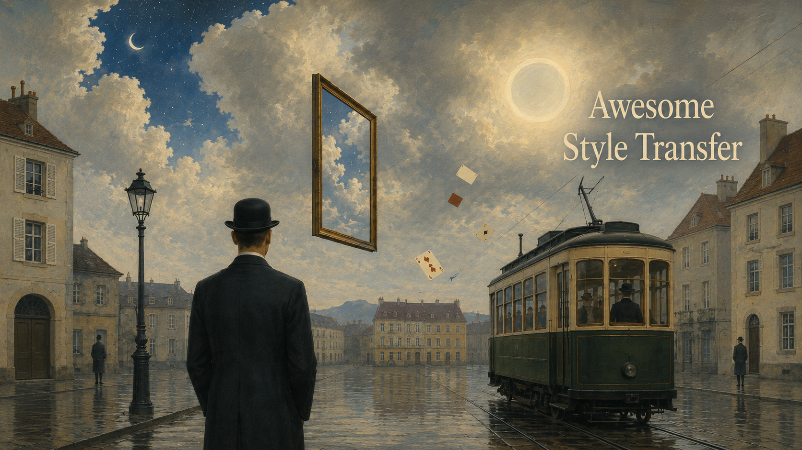
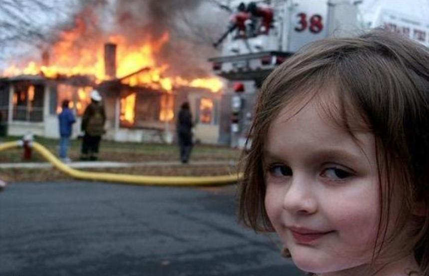
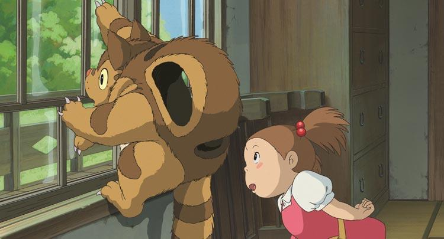
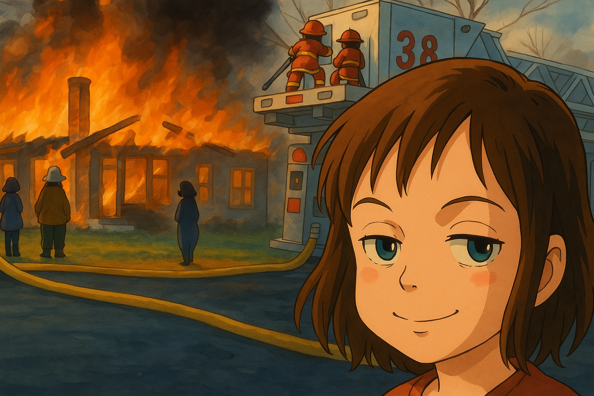
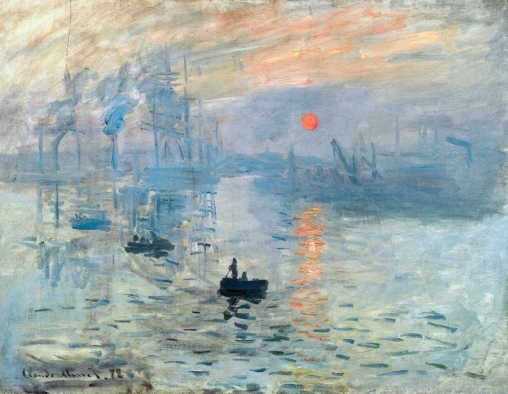

<div align="center">

# 🎨 Awesome Style Transfer

<p align="center">
  
</p>

[](https://awesome.re)
[](https://arxiv.org/abs/2506.19278)
[](https://github.com/neptune-T/Awesome-Style-Transfer)
[](https://github.com/neptune-T/Awesome-Style-Transfer)
[](https://github.com/neptune-T/Awesome-Style-Transfer)
[](https://opensource.org/licenses/MIT)
[](https://github.com/neptune-T/Awesome-Style-Transfer)

<p align="center">
    <a href="#-the-style-carrier-taxonomy">Taxonomy</a> |
    <a href="#-papers-by-style-carrier">Papers</a> |
    <a href="#-coverage-at-a-glance">Coverage</a> |
    <a href="#-datasets">Datasets</a> |
    <a href="#-contributing">Contributing</a>
</p>

</div>

## 🎨 About This Repository

A curated collection of **style transfer** research organized by the **Style-Carrier Taxonomy** introduced in our survey [*Style Transfer: A Decade Survey*](https://arxiv.org/abs/2506.19278).

Instead of grouping papers by year, backbone (CNN / GAN / Diffusion / DiT), or output domain, we ask a single question:

> **In what form is style-specific information materialized, and how is it reused for new content?**

Every method has exactly one canonical home — five *style carriers* spanning 2015–2026 across 🖼️ image, 🎬 video, 🧊 3D and ⏳ 4D stylization.

## 🖼️ Style Transfer Examples

<div align="center">
<table>
  <tr>
    <th>Content Image</th>
    <th>Style Image</th>
    <th>Transferred Result</th>
  </tr>
  <tr>
    <td></td>
    <td></td>
    <td></td>
  </tr>
  <tr>
    <td><em>Disaster Girl</em></td>
    <td><em>となりのトトロ</em></td>
    <td><em>Transferred Result</em></td>
  </tr>
</table>
</div>

## 🧭 The Style-Carrier Taxonomy

<div align="center">

| Carrier | Core idea | Anchors | Papers |
|---------|-----------|---------|:------:|
| 🎯 **Style as Optimization Objective** | Style exists only as a loss, score, or guidance signal — no transferable style representation is ever materialized. | *Gatys et al. 2015* | **20** |
| 🧩 **Style as Feature Operator** | Style acts through direct matching, replacement, transport, or attention coupling of content/style activations. | *AdaIN · WCT* | **27** |
| 🌀 **Style as Latent Variable** | Style is a native generative latent with its own prior — sampleable, mixable, and editable without any reference. | *MUNIT · StyleGAN* | **11** |
| ⚙️ **Style as Model Parameters** | Style is materialized as a persistent parameter asset (weights, LoRA, learned tokens) reusable across new content. | *Johnson 2016 · LoRA* | **25** |
| 🔌 **Style as Learned Condition** | An external reference is encoded into a standalone style condition consumed via a dedicated conditioning interface. | *Ghiasi 2017 · IP-Adapter* | **27** |

</div>

📌 **What the taxonomy is *not* based on:** year, backbone family, output domain, or auxiliary mechanisms (ControlNet, SDS, DDIM inversion …) — those are tags, not categories. The same perceptual objective underlies Gatys (🎯 objective), Johnson (⚙️ parameter) and Ghiasi (🔌 condition); AdaIN, StyTr² and StyleAligned are all 🧩 feature operators despite spanning CNN, Transformer and Diffusion eras.

## 📊 Coverage at a Glance

<div align="center">

| Carrier | 🖼️ Image | 🎬 Video | 🧊 3D | ⏳ 4D |
|---------|:------:|:------:|:---:|:---:|
| 🎯 Optimization Objective | 6 | — | 12 | 1 |
| 🧩 Feature Operator | 22 | 2 | 1 | — |
| 🌀 Latent Variable | 9 | 2 | — | — |
| ⚙️ Model Parameters | 18 | 6 | 1 | — |
| 🔌 Learned Condition | 21 | 2 | 3 | — |

</div>

> Empty cells are **open problems**, not omissions — e.g. ⏳ 4D stylization remains nearly untouched.

## 📑 Table of Contents

1. [🎯 Style as Optimization Objective](#1-style-as-optimization-objective) — 20 papers
2. [🧩 Style as Feature Operator](#2-style-as-feature-operator) — 27 papers
3. [🌀 Style as Latent Variable](#3-style-as-latent-variable) — 11 papers
4. [⚙️ Style as Model Parameters](#4-style-as-model-parameters) — 25 papers
5. [🔌 Style as Learned Condition](#5-style-as-learned-condition) — 27 papers
6. [📚 Datasets](#-datasets)
7. [🤝 Contributing](#-contributing)

## 🗂️ Papers by Style Carrier

### 1. 🎯 Style as Optimization Objective

*Style exists only as a loss, score, or guidance signal — no transferable style representation is ever materialized.*

| Paper | Venue | Year | Rep | Link |
|-------|-------|:----:|:---:|------|
| A neural algorithm of artistic style | arXiv | 2015 | 🖼️ | [paper](https://arxiv.org/abs/1508.06576) |
| Deep photo style transfer | CVPR | 2017 | 🖼️ | [paper](https://arxiv.org/abs/1703.07511) |
| Style transfer by relaxed optimal transport and self-similarity | CVPR | 2019 | 🖼️ | [paper](https://arxiv.org/abs/1904.12785) |
| Arf: Artistic radiance fields | ECCV | 2022 | 🧊 | [paper](https://arxiv.org/abs/2206.06360) |
| CLIPstyler: Image style transfer with a single text condition | CVPR | 2022 | 🖼️ | [paper](https://arxiv.org/abs/2112.00374) |
| SNeRF: Stylized neural implicit representations for 3D scenes | SIGGRAPH Asia | 2022 | 🧊 | [paper](https://arxiv.org/abs/2207.02363) |
| StyleMesh: Style transfer for indoor 3D scene reconstructions | CVPR | 2022 | 🧊 | [paper](https://arxiv.org/abs/2112.01530) |
| Diffusion-based image translation using disentangled style and content representation | ICLR | 2023 | 🖼️ | [paper](https://arxiv.org/abs/2209.15264) |
| Ref-NPR: Reference-Based Non-Photorealistic Radiance Fields for Controllable Scene Stylization | CVPR | 2023 | 🧊 | [paper](https://arxiv.org/abs/2212.02766) |
| 3D Paintbrush: Local Stylization of 3D Shapes with Cascaded Score Distillation | CVPR | 2024 | 🧊 | [paper](https://arxiv.org/abs/2311.09571) |
| NeRF-Art: Text-Driven Neural Radiance Fields Stylization | IEEE TVCG | 2024 | 🧊 | [paper](https://arxiv.org/abs/2212.08070) |
| Balanced image stylization with style matching score | ICCV | 2025 | 🖼️ | [paper](https://arxiv.org/abs/2503.07601) |
| CLIPGaussian: Universal and Multimodal Style Transfer Based on Gaussian Splatting | NeurIPS | 2025 | 🌐 | [paper](https://arxiv.org/abs/2505.22854) |
| GAS-NeRF: Geometry-Aware Stylization of Dynamic Radiance Fields | arXiv | 2025 | ⏳ | [paper](https://arxiv.org/abs/2503.08483) |
| GT²-GS: Geometry-aware Texture Transfer for Gaussian Splatting | arXiv | 2025 | 🧊 | [paper](https://arxiv.org/abs/2505.15208) |
| Morpheus: Text-Driven 3D Gaussian Splat Shape and Color Stylization | CVPR | 2025 | 🧊 | [paper](https://arxiv.org/abs/2503.02009) |
| SGSST: Scaling Gaussian Splatting Style Transfer | CVPR | 2025 | 🧊 | [paper](https://arxiv.org/abs/2412.03371) |
| Stylizedgs: Controllable stylization for 3d gaussian splatting | TPAMI | 2025 | 🧊 | [paper](https://arxiv.org/abs/2404.05220) |
| DiffStyle3D: Consistent 3D Gaussian Stylization via Attention Optimization | arXiv | 2026 | 🧊 | [paper](https://arxiv.org/abs/2601.19717) |
| Fantasystyle: Controllable stylized distillation for 3d gaussian splatting | AAAI | 2026 | 🧊 | [paper](https://arxiv.org/abs/2508.08136) |

### 2. 🧩 Style as Feature Operator

*Style acts through direct matching, replacement, transport, or attention coupling of content/style activations.*

| Paper | Venue | Year | Rep | Link |
|-------|-------|:----:|:---:|------|
| Arbitrary style transfer in real-time with adaptive instance normalization | ICCV | 2017 | 🖼️ | [paper](https://arxiv.org/abs/1703.06868) |
| Universal style transfer via feature transforms | NeurIPS | 2017 | 🖼️ | [paper](https://arxiv.org/abs/1705.08086) |
| A closed-form solution to photorealistic image stylization | ECCV | 2018 | 🖼️ | [paper](https://arxiv.org/abs/1802.06474) |
| Avatar-net: Multi-scale zero-shot style transfer by feature decoration | CVPR | 2018 | 🖼️ | [paper](https://arxiv.org/abs/1805.03857) |
| Arbitrary Style Transfer with Style-Attentional Networks | CVPR | 2019 | 🖼️ | [paper](https://arxiv.org/abs/1812.02342) |
| Learning linear transformations for fast image and video style transfer | CVPR | 2019 | 🌐 | [paper](https://arxiv.org/abs/1808.04537) |
| Photorealistic style transfer via wavelet transforms | ICCV | 2019 | 🖼️ | [paper](https://arxiv.org/abs/1903.09760) |
| AdaAttN: Revisit attention mechanism in arbitrary neural style transfer | ICCV | 2021 | 🖼️ | [paper](https://arxiv.org/abs/2108.03647) |
| Arbitrary video style transfer via multi-channel correlation | ICCV | 2021 | 🎬 | [paper](https://arxiv.org/abs/2009.08003) |
| Artflow: Unbiased image style transfer via reversible neural flows | CVPR | 2021 | 🖼️ | [paper](https://arxiv.org/abs/2103.16877) |
| CCPL: Contrastive coherence preserving loss for versatile style transfer | ECCV | 2022 | 🌐 | [paper](https://arxiv.org/abs/2207.04808) |
| Domain enhanced arbitrary image style transfer via contrastive learning | SIGGRAPH | 2022 | 🖼️ | [paper](https://arxiv.org/abs/2205.09542) |
| Exact feature distribution matching for arbitrary style transfer and domain generalization | CVPR | 2022 | 🖼️ | [paper](https://arxiv.org/abs/2203.07740) |
| Stytr2: Image style transfer with transformers | CVPR | 2022 | 🖼️ | [paper](https://arxiv.org/abs/2105.14576) |
| CAP-VSTNet: Content affinity preserved versatile style transfer | CVPR | 2023 | 🖼️ | [paper](https://arxiv.org/abs/2303.17867) |
| Ctrl-x: Controlling structure and appearance for text-to-image generation without guidance | NeurIPS | 2024 | 🖼️ | [paper](https://arxiv.org/abs/2406.07540) |
| Puff-Net: Efficient Style Transfer with Pure Content and Style Feature Fusion Network | CVPR | 2024 | 🖼️ | [paper](https://arxiv.org/abs/2405.19775) |
| Style aligned image generation via shared attention | CVPR | 2024 | 🖼️ | [paper](https://arxiv.org/abs/2312.02133) |
| Style injection in diffusion: A training-free approach for adapting large-scale diffusion models for style transfer | CVPR | 2024 | 🖼️ | [paper](https://arxiv.org/abs/2312.09008) |
| Training-free consistent text-to-image generation | ACM TOG | 2024 | 🖼️ | [paper](https://arxiv.org/abs/2402.03286) |
| AttenST: A Training-Free Attention-Driven Style Transfer Framework with Pre-Trained Diffusion Models | arXiv | 2025 | 🖼️ | [paper](https://arxiv.org/abs/2503.07307) |
| DVI: Disentangling Semantic and Visual Identity for Training-Free Personalized Generation | arXiv | 2025 | 🖼️ | [paper](https://arxiv.org/abs/2512.18964) |
| FPGS: Feed-Forward Semantic-aware Photorealistic Style Transfer of Large-Scale Gaussian Splatting | Int. J. Comput. Vis. 2026 | 2025 | 🧊 | [paper](https://arxiv.org/abs/2503.09635) |
| SCSA: A Plug-and-Play Semantic Continuous-Sparse Attention for Arbitrary Semantic Style Transfer | CVPR | 2025 | 🖼️ | [paper](https://arxiv.org/abs/2503.04119) |
| SOYO: A Tuning-Free Approach for Video Style Morphing via Style-Adaptive Interpolation in Diffusion Models | arXiv | 2025 | 🎬 | [paper](https://arxiv.org/abs/2503.06998) |
| StyleSSP: Sampling StartPoint Enhancement for Training-free Diffusion-based Method for Style Transfer | CVPR | 2025 | 🖼️ | [paper](https://arxiv.org/abs/2501.11319) |
| StyleStudio: Text-Driven Style Transfer with Selective Control of Style Elements | CVPR | 2025 | 🖼️ | [paper](https://arxiv.org/abs/2412.08503) |

### 3. 🌀 Style as Latent Variable

*Style is a native generative latent with its own prior — sampleable, mixable, and editable without any reference.*

| Paper | Venue | Year | Rep | Link |
|-------|-------|:----:|:---:|------|
| Diverse image-to-image translation via disentangled representations | ECCV | 2018 | 🖼️ | [paper](https://arxiv.org/abs/1808.00948) |
| MoCoGAN: Decomposing motion and content for video generation | CVPR | 2018 | 🎬 | [paper](https://arxiv.org/abs/1707.04993) |
| Multimodal unsupervised image-to-image translation | ECCV | 2018 | 🖼️ | [paper](https://arxiv.org/abs/1804.04732) |
| Multimodal Unsupervised Image-to-image Translation | ECCV | 2018 | 🖼️ | [paper](https://arxiv.org/abs/1804.04732) |
| A style-based generator architecture for generative adversarial networks | CVPR | 2019 | 🖼️ | [paper](https://arxiv.org/abs/1812.04948) |
| Analyzing and Improving the Image Quality of StyleGAN | CVPR | 2020 | 🖼️ | [paper](https://arxiv.org/abs/1912.04958) |
| Analyzing and Improving the Image Quality of StyleGAN | CVPR | 2020 | 🖼️ | [paper](https://arxiv.org/abs/1912.04958) |
| Alias-Free Generative Adversarial Networks | NeurIPS | 2021 | 🖼️ | [paper](https://arxiv.org/abs/2106.12423) |
| Styleclip: Text-driven manipulation of stylegan imagery | ICCV | 2021 | 🖼️ | [paper](https://arxiv.org/abs/2103.17249) |
| Diffusion autoencoders: Toward a meaningful and decodable representation | CVPR | 2022 | 🖼️ | [paper](https://arxiv.org/abs/2111.15640) |
| Styleinv: A temporal style modulated inversion network for unconditional video generation | ICCV | 2023 | 🎬 | [paper](https://arxiv.org/abs/2308.16909) |

### 4. ⚙️ Style as Model Parameters

*Style is materialized as a persistent parameter asset (weights, LoRA, learned tokens) reusable across new content.*

| Paper | Venue | Year | Rep | Link |
|-------|-------|:----:|:---:|------|
| Perceptual losses for real-time style transfer and super-resolution | ECCV | 2016 | 🖼️ | [paper](https://arxiv.org/abs/1603.08155) |
| Texture networks: Feed-forward synthesis of textures and stylized images | ICML | 2016 | 🖼️ | [paper](https://arxiv.org/abs/1603.03417) |
| A Learned Representation for Artistic Style | ICLR | 2017 | 🖼️ | [paper](https://arxiv.org/abs/1610.07629) |
| Coherent online video style transfer | ICCV | 2017 | 🎬 | [paper](https://arxiv.org/abs/1703.09211) |
| Real-time neural style transfer for videos | CVPR | 2017 | 🎬 | [paper](https://openaccess.thecvf.com/content_cvpr_2017/html/Huang_Real-Time_Neural_Style_CVPR_2017_paper.html) |
| ReCoNet: Real-time coherent video style transfer network | ECCV | 2018 | 🎬 | [paper](https://arxiv.org/abs/1807.01197) |
| VToonify: Controllable High-Resolution Portrait Video Style Transfer | ACM TOG | 2022 | 🎬 | [paper](https://arxiv.org/abs/2209.11224) |
| An image is worth one word: Personalizing text-to-image generation using textual inversion | ICLR | 2023 | 🖼️ | [paper](https://arxiv.org/abs/2208.01618) |
| Break-a-scene: Extracting multiple concepts from a single image | SIGGRAPH Asia | 2023 | 🖼️ | [paper](https://arxiv.org/abs/2305.16311) |
| Cones: Concept neurons in diffusion models for customized generation | ICML | 2023 | 🖼️ | [paper](https://arxiv.org/abs/2303.05125) |
| DreamBooth3D: Subject-Driven Text-to-3D Generation | ICCV | 2023 | 🧊 | [paper](https://arxiv.org/abs/2303.13508) |
| Dreambooth: Fine tuning text-to-image diffusion models for subject-driven generation | CVPR | 2023 | 🖼️ | [paper](https://arxiv.org/abs/2208.12242) |
| Inversion-Based Style Transfer With Diffusion Models | CVPR | 2023 | 🖼️ | [paper](https://arxiv.org/abs/2211.13203) |
| Key-locked rank one editing for text-to-image personalization | SIGGRAPH | 2023 | 🖼️ | [paper](https://arxiv.org/abs/2305.01644) |
| Mix-of-show: Decentralized low-rank adaptation for multi-concept customization of diffusion models | NeurIPS | 2023 | 🖼️ | [paper](https://arxiv.org/abs/2305.18292) |
| Multi-concept customization of text-to-image diffusion | CVPR | 2023 | 🖼️ | [paper](https://arxiv.org/abs/2212.04488) |
| Prospect: Prompt spectrum for attribute-aware personalization of diffusion models | ACM TOG | 2023 | 🖼️ | [paper](https://arxiv.org/abs/2305.16225) |
| Styledrop: Text-to-image generation in any style | arXiv | 2023 | 🖼️ | [paper](https://arxiv.org/abs/2306.00983) |
| Dreamvideo: Composing your dream videos with customized subject and motion | CVPR | 2024 | 🎬 | [paper](https://arxiv.org/abs/2312.04433) |
| Implicit style-content separation using b-lora | ECCV | 2024 | 🖼️ | [paper](https://arxiv.org/abs/2403.14572) |
| Magic-me: Identity-specific video customized diffusion | ECCV | 2024 | 🎬 | [paper](https://arxiv.org/abs/2402.09368) |
| ZipLoRA: Any Subject in Any Style by Effectively Merging LoRAs | ECCV | 2024 | 🖼️ | [paper](https://arxiv.org/abs/2311.13600) |
| APT: Adaptive Personalized Training for Diffusion Models with Limited Data | CVPR | 2025 | 🖼️ | [paper](https://arxiv.org/abs/2507.02687) |
| ConsisLoRA: Enhancing Content and Style Consistency for LoRA-based Style Transfer | arXiv | 2025 | 🖼️ | [paper](https://arxiv.org/abs/2503.10614) |
| Photodoodle: Learning artistic image editing from few-shot pairwise data | arXiv | 2025 | 🖼️ | [paper](https://arxiv.org/abs/2502.14397) |

### 5. 🔌 Style as Learned Condition

*An external reference is encoded into a standalone style condition consumed via a dedicated conditioning interface.*

| Paper | Venue | Year | Rep | Link |
|-------|-------|:----:|:---:|------|
| CLIP-NeRF: Text-and-image driven manipulation of neural radiance fields | CVPR | 2022 | 🧊 | [paper](https://arxiv.org/abs/2112.05139) |
| Blip-diffusion: Pre-trained subject representation for controllable text-to-image generation and editing | NeurIPS | 2023 | 🖼️ | [paper](https://arxiv.org/abs/2305.14720) |
| Elite: Encoding visual concepts into textual embeddings for customized text-to-image generation | ICCV | 2023 | 🖼️ | [paper](https://arxiv.org/abs/2302.13848) |
| IP-Adapter: Text Compatible Image Prompt Adapter for Text-to-Image Diffusion Models | arXiv | 2023 | 🖼️ | [paper](https://arxiv.org/abs/2308.06721) |
| Arc2Face: A Foundation Model for ID-Consistent Human Faces | ECCV | 2024 | 🖼️ | [paper](https://arxiv.org/abs/2403.11641) |
| ArtAdapter: Text-to-Image Style Transfer using Multi-Level Style Encoder and Explicit Adaptation | CVPR | 2024 | 🖼️ | [paper](https://arxiv.org/abs/2312.02109) |
| Deadiff: An efficient stylization diffusion model with disentangled representations | CVPR | 2024 | 🖼️ | [paper](https://arxiv.org/abs/2403.06951) |
| DiffStyler: Diffusion-based Localized Image Style Transfer | arXiv | 2024 | 🖼️ | [paper](https://arxiv.org/abs/2403.18461) |
| Instantid: Zero-shot identity-preserving generation in seconds | arXiv | 2024 | 🖼️ | [paper](https://arxiv.org/abs/2401.07519) |
| InstantStyle-Plus: Style Transfer with Content-Preserving in Text-to-Image Generation | arXiv | 2024 | 🖼️ | [paper](https://arxiv.org/abs/2407.00788) |
| InstantStyle: Free Lunch towards Style-Preserving in Text-to-Image Generation | arXiv | 2024 | 🖼️ | [paper](https://arxiv.org/abs/2404.02733) |
| Photomaker: Customizing realistic human photos via stacked id embedding | CVPR | 2024 | 🖼️ | [paper](https://arxiv.org/abs/2312.04461) |
| Pulid: Pure and lightning id customization via contrastive alignment | NeurIPS | 2024 | 🖼️ | [paper](https://arxiv.org/abs/2404.16022) |
| Ssr-encoder: Encoding selective subject representation for subject-driven generation | CVPR | 2024 | 🖼️ | [paper](https://arxiv.org/abs/2312.16272) |
| StyleCrafter: Taming Artistic Video Diffusion with Reference-Augmented Adapter Learning | ACM TOG | 2024 | 🎬 | [paper](https://arxiv.org/abs/2312.00330) |
| CSGO: Content-Style Composition in Text-to-Image Generation | NeurIPS | 2025 | 🖼️ | [paper](https://arxiv.org/abs/2408.16766) |
| Free-lunch color-texture disentanglement for stylized image generation | NeurIPS | 2025 | 🖼️ | [paper](https://arxiv.org/abs/2503.14275) |
| ID-Consistent, Precise Expression Generation with Blendshape-Guided Diffusion | ICCV | 2025 | 🖼️ | [paper](https://arxiv.org/abs/2510.04706) |
| Nested attention: Semantic-aware attention values for concept personalization | SIGGRAPH | 2025 | 🖼️ | [paper](https://arxiv.org/abs/2501.01407) |
| Omni-Attribute: Open-vocabulary Attribute Encoder for Visual Concept Personalization | arXiv | 2025 | 🖼️ | [paper](https://arxiv.org/abs/2512.10955) |
| Stylemaster: Stylize your video with artistic generation and translation | CVPR | 2025 | 🎬 | [paper](https://arxiv.org/abs/2412.07744) |
| Styleshot: A snapshot on any style | TPAMI | 2025 | 🖼️ | [paper](https://arxiv.org/abs/2407.01414) |
| Stylos: Multi-View 3D Stylization with Single-Forward Gaussian Splatting | arXiv | 2025 | 🧊 | [paper](https://arxiv.org/abs/2509.26455) |
| U-StyDiT: Ultra-high quality artistic style transfer using diffusion transformers | arXiv preprint arXiv:2503.08157 | 2025 | 🖼️ | [paper](https://arxiv.org/abs/2503.08157) |
| Uso: Unified style and subject-driven generation via disentangled and reward learning | arXiv preprint arXiv:2508.18966 | 2025 | 🖼️ | [paper](https://arxiv.org/abs/2508.18966) |
| AnyStyle: Single-Pass Multimodal Stylization for 3D Gaussian Splatting | arXiv | 2026 | 🧊 | [paper](https://arxiv.org/abs/2602.04043) |
| TeleStyle: Content-Preserving Style Transfer in Images and Videos | arXiv preprint arXiv:2601.20175 | 2026 | 🌐 | [paper](https://arxiv.org/abs/2601.20175) |

## 📚 Datasets

<details open>
<summary><b>🖼️ Image Datasets</b></summary>

| Dataset | Year | Size | Description | Link |
|---------|------|------|-------------|------|
| WikiArt | 2018 | 42,129 images | Style, Artist, Genre | [link](https://huggingface.co/datasets/huggan/wikiart) |
| Stylized ImageNet | 2018 | ~134GB | Style Transfer | [link](https://github.com/rgeirhos/Stylized-ImageNet) |
| BAM | 2017 | 2.5M images | Artistic Media | [link](https://bam-dataset.org/) |
| ArtBench-10 | 2022 | 60,000 images | Artwork Benchmark | [link](https://github.com/liaochongyang/ArtBench-10) |
| FFHQ | 2019 | 70,000 images | Human Faces | [link](https://github.com/NVlabs/ffhq-dataset) |
| MetFaces | 2020 | 1,336 images | Artistic Faces | [link](https://github.com/NVlabs/metfaces-dataset) |
| AAHQ | 2021 | 25,000 images | Artistic Faces | [link](https://github.com/onion-liu/aahq-dataset) |
| Ukiyo-e Faces | 2020 | 5,209 images | Aligned Ukiyo-e Faces | [link](https://www.justinpinkney.com/blog/2020/ukiyoe-dataset/) |
| DiffusionDB | 2022 | 14M images | Text-to-image | [link](https://github.com/poloclub/diffusiondb) |
| JourneyDB | 2023 | 4.4M images | Multimodal Vision | [link](https://journeydb.github.io/) |
| StyleShot | 2024 | - | Style Transfer | [link](https://styleshot.github.io/) |
| Danbooru2017 | 2017 | 2.94M images | Anime | [link](https://danbooru.donmai.us/posts?tags=2017) |
| Chinese Style Transfer | 2018 | 1000 content, 100 style | Chinese Painting | [link](https://github.com/lbsswu/Chinese_style_transfer) |
| 4SKST | 2023 | 25 color, 100 sketches | Sketch Style | [link](https://github.com/Chanuku/4skst) |

</details>

<details>
<summary><b>🎬 Video Datasets</b></summary>

| Dataset | Year | Size | Description | Link |
|---------|------|------|-------------|------|
| UADFV | 2018 | 100 videos | Video Style Transfer | [link](https://arxiv.org/abs/1811.00661) |
| FaceForensics++ | 2019 | 6000 videos | Swapped Face | [link](https://github.com/ondyari/FaceForensics) |
| Celeb-DF | 2020 | 408 original videos | DeepFake | [link](https://github.com/yuezunli/celeb-deepfakeforensics) |
| DFDC | 2020 | 100,000 clips | DeepFake Detection | [link](https://www.kaggle.com/c/deepfake-detection-challenge) |
| FFIW-10K | 2021 | 10,000 videos | Face Forgery | [link](https://github.com/tfzhou/FFIW) |
| ForgeryNet | 2021 | 221,247 videos | Forgery Analysis | [link](https://github.com/yinanhe/forgerynet) |

</details>

<details>
<summary><b>🧊 3D / Motion Datasets</b></summary>

| Dataset | Year | Size | Description | Link |
|---------|------|------|-------------|------|
| 100STYLE | 2022 | 4M frames | Stylized Motion Capture | [link](https://zenodo.org/records/8127870) |
| Motiondataset | 2023 | 36,673 frames | 3D Motion | [link](https://github.com/BandaiNamcoResearchInc/Bandai-Namco-Research-Motiondataset) |

</details>

## 🤝 Contributing

We welcome contributions! When suggesting a paper, please indicate which **style carrier** it belongs to:

- 🎯 **Objective** — style lives only in the loss / score / guidance
- 🧩 **Feature** — direct activation matching, transport, or attention coupling
- 🌀 **Latent** — native generative latent, sampleable without a reference
- ⚙️ **Parameter** — persistent style asset (weights / LoRA / tokens)
- 🔌 **Condition** — reference-encoded standalone style condition

Ways to help:

- 🐛 Report bugs and issues
- 💡 Suggest new papers or resources
- 🔧 Submit pull requests
- ⭐ Star this repository if you find it helpful!

## 📖 Citation

If you find this repository useful for your research, please consider citing:

```bibtex
@article{zhang2025style,
  title={Style transfer: A decade survey},
  author={Zhang, Tianshan and Tang, Hao},
  journal={arXiv preprint arXiv:2506.19278},
  year={2025}
}
```

## ⭐ Star History

[](https://star-history.com/#neptune-T/Awesome-Style-Transfer&Date)

## 🙏 Acknowledgments

Thanks to all researchers and developers who made their work publicly available.

<p align="center">

</p>

<div align="center">
  <sub>By Monet's Impression of Sunrise</sub>
</div>
