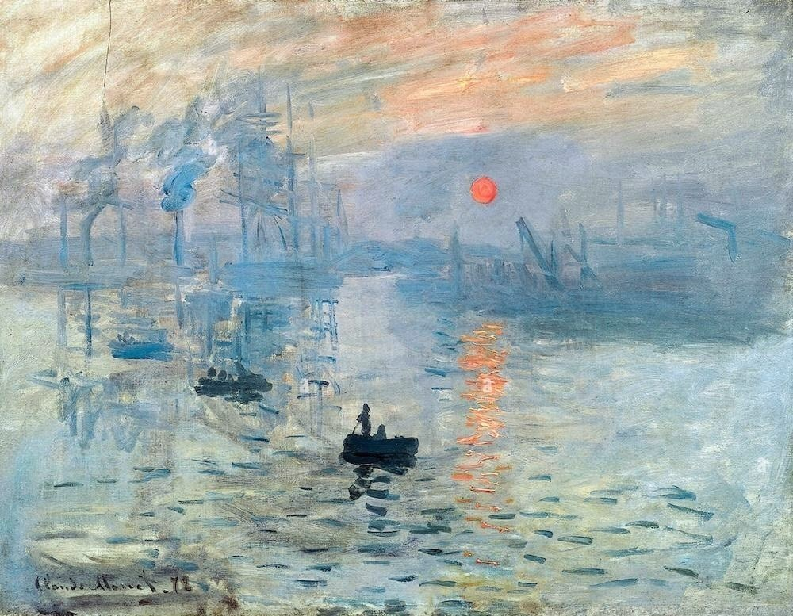

# Awesome Style Transfer Papers [](https://awesome.re)

<p align="center">
  
</p>

A curated collection of cutting-edge research papers, datasets, and resources in the field of Style Transfer across various domains. From traditional methods to the latest diffusion models, this repository aims to be your go-to resource for style transfer research.


## 🚀 Highlights

- **A vast collection** carefully selected papers from 2016 to 2024
- **5** major categories of methods
- **Multiple domains** including image, video, 3D, and text
- **Rich datasets** across different applications
- **Active community** and regular updates

## 📑 Contents

### 🎨 Methods
<details>
<summary>Click to expand</summary>

- [Traditional Methods](Methods/traditional.md) - Classical approaches to style transfer
- [GAN-based Methods](Methods/gan.md) - Generative adversarial network approaches
- [VAE-based Methods](Methods/vae.md) - Variational autoencoder methods
- [Diffusion-based Methods](Methods/Diffusion.md) - Latest advances in diffusion models
</details>

### 💡 Applications
<details>
<summary>Click to expand</summary>

- [Text Style Transfer](application/text.md) - Natural language style transformation
- [Video Style Transfer](application/video.md) - Temporal coherent style transfer
- [3D Style Transfer](application/3d.md) - Style transfer in 3D space
- [Domain Adaptation](application/domain.md) - Cross-domain style adaptation
- [Portrait Style Transfer](application/portrait.md) - Human portrait stylization
</details>

### 📊 Datasets & Resources
<details>
<summary>Click to expand</summary>

- [Image Datasets](dataset/image_dataset.md)
- [Video Datasets](dataset/video_dataset.md)
- [3D Datasets](dataset/3d_dataset.md)
- [Text Datasets](dataset/text_dataset.md)
- [Domain Datasets](dataset/domain_dataset.md)
</details>


## 🌟 Features

- 📚 **Comprehensive Coverage**: From foundational papers to cutting-edge research
- 🔍 **Easy Navigation**: Well-organized categories and subcategories
- 🔄 **Regular Updates**: Latest papers and methods added frequently
- 🔗 **Implementation Links**: Direct access to official code repositories
- 📋 **Detailed Documentation**: Clear descriptions and categorizations

## 🤝 Contributing

We welcome contributions! Here's how you can help:

- 🐛 Report bugs and issues
- 💡 Suggest new papers or resources
- 🔧 Submit pull requests
- ⭐ Star this repository if you find it helpful!

See our [Contributing Guidelines](CONTRIBUTING.md) for more details.

## 📖 Citation

If you find this repository useful for your research, please consider citing:

```bibtex

Still updating

```

## 📈 Star History

[](https://star-history.com/#neptune-T/Awesome-Style-Transfer&Date)

## 📄 License

This project is licensed under the MIT License - see the [LICENSE](LICENSE) file for details.

## 🙏 Acknowledgments

Special thanks to all researchers and developers who have contributed to the field of style transfer and made their work publicly available.

<p align="center">
  
</p>

<div align="center">
  <sub>By Monet's Impression of Sunrise</sub>
</div>